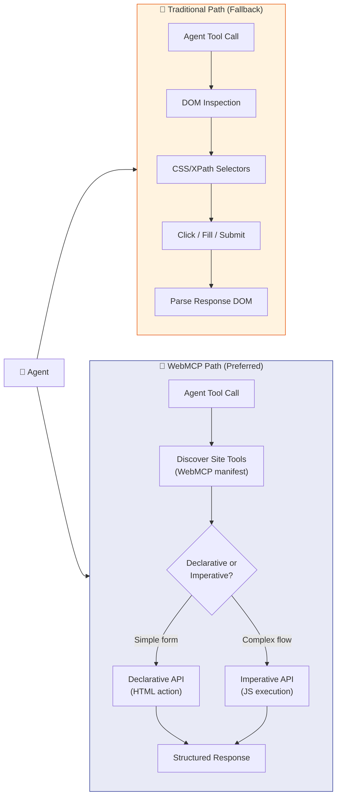
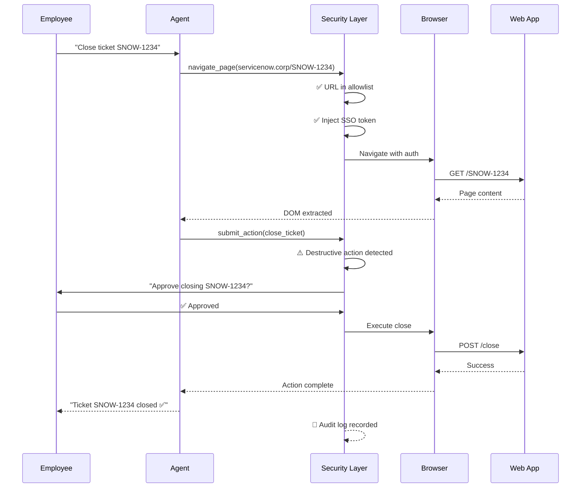
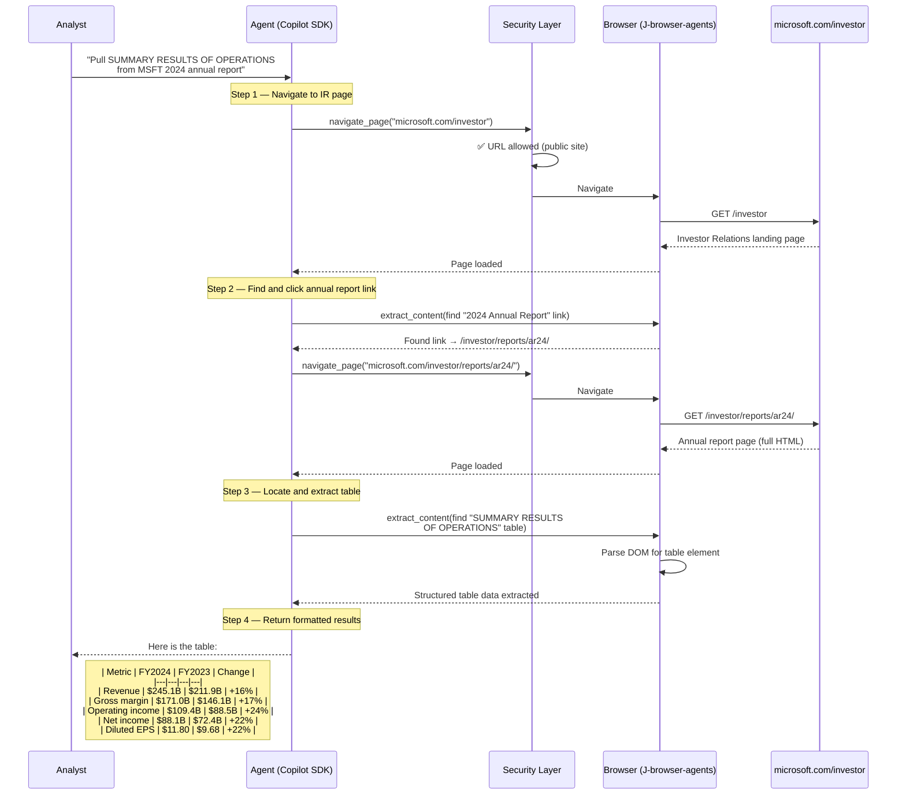
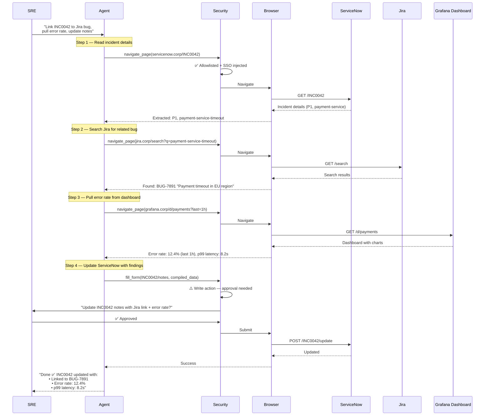
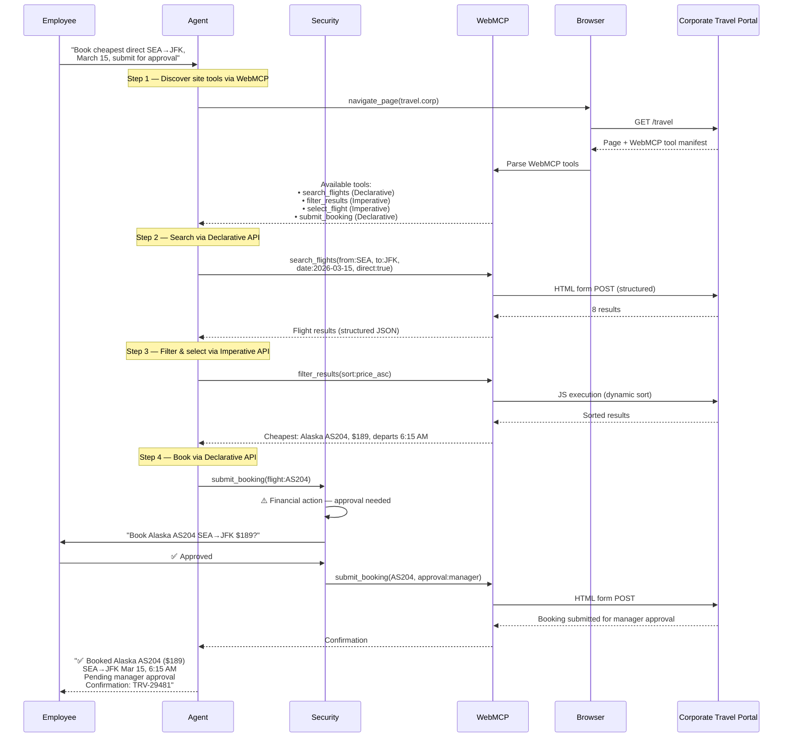
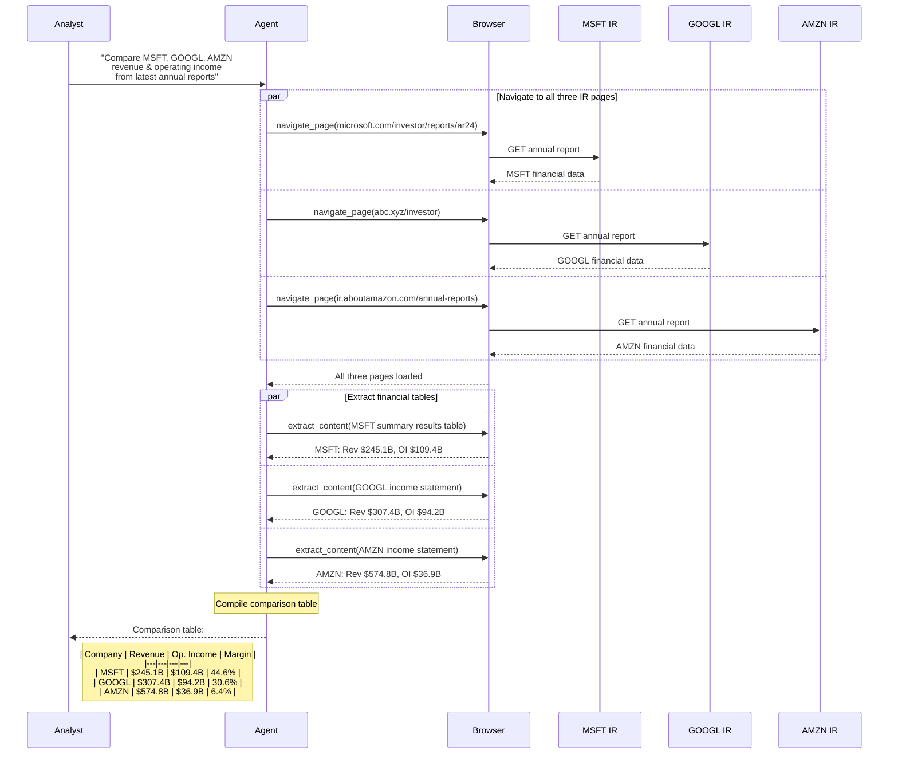
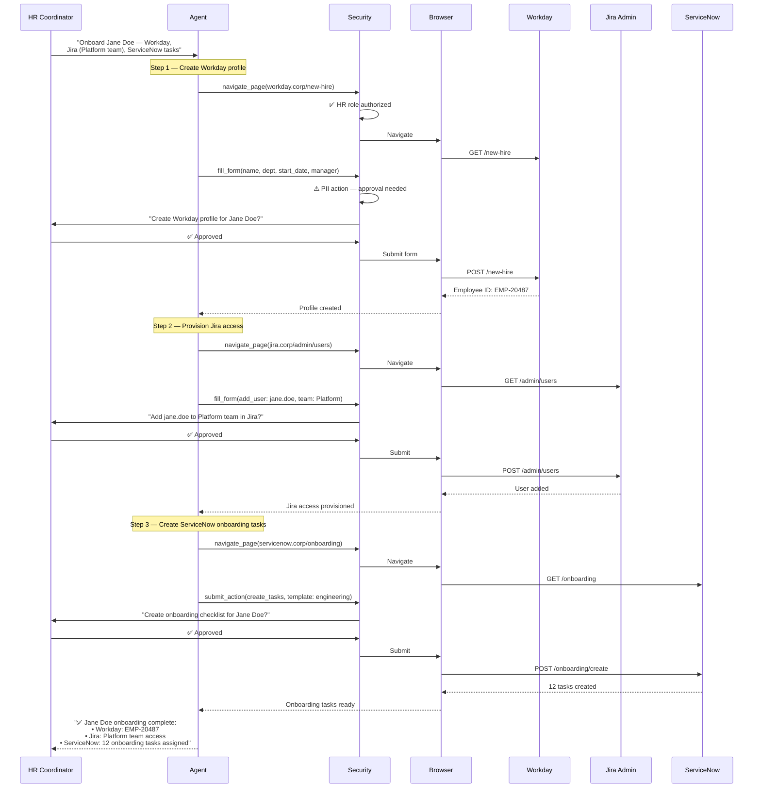

# Secure Enterprise Browser Agentic System — Architecture

## System Diagram

```mermaid
flowchart TB
    subgraph UserLayer["👤 User Layer"]
        Employee["Employee"]
        CopilotChat["Copilot Chat / CLI Interface"]
    end

    subgraph AgentOrchestrator["🤖 Agent Orchestrator (Copilot SDK)"]
        Planner["Task Planner\n(Multi-step Workflow Engine)"]
        Memory["Context & Memory Store"]
        Router["Tool Router"]
    end

    subgraph SecurityLayer["🔒 Security Boundary Layer"]
        AuthDelegation["Auth Delegation\n(SSO / Token Proxy)"]
        URLAllowlist["URL Allowlisting\n(Domain & Path Rules)"]
        ApprovalGate["Action Approval Gate\n(Human-in-the-Loop)"]
        AuditLog["Audit Log &\nCompliance Trail"]
    end

    subgraph ToolLayer["🛠️ Agent Tools"]
        Navigate["navigate_page\n(URL navigation,\nclick, scroll)"]
        Extract["extract_content\n(Read & summarize\npage data)"]
        FillForm["fill_form\n(Input fields,\ndropdowns, dates)"]
        Submit["submit_action\n(Buttons, approvals,\nstate transitions)"]
    end

    subgraph WebMCPLayer["📡 WebMCP Protocol Layer (Chrome EPP)"]
        Declarative["Declarative API\n(HTML form-based\nstructured actions)"]
        Imperative["Imperative API\n(JS-executed\ndynamic interactions)"]
        ToolDiscovery["Tool Discovery\n(Site-exposed structured\ntool definitions)"]
    end

    subgraph BrowserEngine["🌐 Browser Automation (J-browser-agents)"]
        Headless["Headless Browser\nInstance Pool"]
        DOMParser["DOM Parser &\nElement Selector"]
        SessionMgr["Session & Cookie\nManager"]
    end

    subgraph TargetApps["🏢 Target Web Applications"]
        subgraph InternalApps["Internal Enterprise Apps"]
            ServiceNow["ServiceNow\n(ITSM / Tickets)"]
            Jira["Jira\n(Project Tracking)"]
            Dashboards["Internal Dashboards\n(Analytics / Reports)"]
        end
        subgraph PublicApps["Public / External Sites"]
            InvestorPages["Investor Relations\n(Annual Reports, SEC)"]
            ECommerce["E-Commerce\n(Procurement)"]
            TravelBooking["Travel Portals\n(Booking / Expenses)"]
        end
    end

    %% User → Agent
    Employee -->|"Natural language request"| CopilotChat
    CopilotChat -->|"Parsed intent"| Planner
    Planner <-->|"State tracking"| Memory
    Planner -->|"Tool calls"| Router

    %% Router → Tools
    Router -->|"Route to tool"| Navigate
    Router -->|"Route to tool"| Extract
    Router -->|"Route to tool"| FillForm
    Router -->|"Route to tool"| Submit

    %% Tools → Security
    Navigate & Extract & FillForm & Submit -->|"All actions pass through"| SecurityLayer

    %% Security → WebMCP / Browser
    AuthDelegation -->|"Inject auth tokens"| Headless
    URLAllowlist -->|"Validate target URL"| Headless
    ApprovalGate -->|"Request user confirmation\n(destructive actions)"| Employee
    ApprovalGate -->|"Approved action"| Headless
    AuditLog -.->|"Log every action"| SecurityLayer

    %% WebMCP integration
    SecurityLayer -->|"Prefer structured path\nwhen available"| WebMCPLayer
    SecurityLayer -->|"Fallback: raw DOM"| Headless
    ToolDiscovery -->|"Discover site-exposed\ntools & schemas"| Planner
    Declarative -->|"Form submission\nvia HTML actions"| Headless
    Imperative -->|"JS execution\nfor complex flows"| Headless

    %% Browser internals
    Headless <--> DOMParser
    Headless <--> SessionMgr

    %% Browser → Target apps
    Headless -->|"HTTP/S"| ServiceNow
    Headless -->|"HTTP/S"| Jira
    Headless -->|"HTTP/S"| Dashboards
    Headless -->|"HTTP/S"| InvestorPages
    Headless -->|"HTTP/S"| ECommerce
    Headless -->|"HTTP/S"| TravelBooking

    %% Results back to agent
    Extract -->|"Structured data /\nsummarized content"| Planner
    Submit -->|"Action result"| Planner
    Planner -->|"Final response"| CopilotChat
    CopilotChat -->|"Answer / confirmation"| Employee

    %% Styling
    classDef userStyle fill:#E3F2FD,stroke:#1565C0,color:#0D47A1
    classDef agentStyle fill:#F3E5F5,stroke:#7B1FA2,color:#4A148C
    classDef securityStyle fill:#FFEBEE,stroke:#C62828,color:#B71C1C
    classDef toolStyle fill:#E8F5E9,stroke:#2E7D32,color:#1B5E20
    classDef webmcpStyle fill:#E8EAF6,stroke:#283593,color:#1A237E
    classDef browserStyle fill:#FFF3E0,stroke:#E65100,color:#BF360C
    classDef internalStyle fill:#F1F8E9,stroke:#558B2F,color:#33691E
    classDef publicStyle fill:#FFF8E1,stroke:#F9A825,color:#F57F17

    class Employee,CopilotChat userStyle
    class Planner,Memory,Router agentStyle
    class AuthDelegation,URLAllowlist,ApprovalGate,AuditLog securityStyle
    class Navigate,Extract,FillForm,Submit toolStyle
    class Declarative,Imperative,ToolDiscovery webmcpStyle
    class Headless,DOMParser,SessionMgr browserStyle
    class ServiceNow,Jira,Dashboards internalStyle
    class InvestorPages,ECommerce,TravelBooking publicStyle
```

## Layer Descriptions

| Layer | Purpose |
|---|---|
| **User Layer** | Employee interacts via natural language through Copilot Chat or CLI |
| **Agent Orchestrator** | Copilot SDK plans multi-step workflows, tracks context, and routes tool calls |
| **Security Boundary** | Auth delegation (SSO/token proxy), URL allowlisting, human-in-the-loop approval gates, and full audit logging |
| **Agent Tools** | Four core tools — `navigate_page`, `extract_content`, `fill_form`, `submit_action` |
| **WebMCP Protocol** | Chrome's [WebMCP](https://developer.chrome.com/blog/webmcp-epp) standard — sites expose structured tools via **Declarative API** (HTML forms) and **Imperative API** (JavaScript), enabling faster and more reliable agent workflows than raw DOM manipulation |
| **Browser Automation** | J-browser-agents manages headless browser instances, DOM parsing, and session/cookie handling |
| **Target Apps** | Internal enterprise apps (ServiceNow, Jira, dashboards) and public/external sites (investor pages, e-commerce, travel portals) |

## WebMCP Integration

> **Why WebMCP matters:** When a website exposes WebMCP tools, the agent skips brittle DOM scraping and uses the site's own structured APIs. This is faster, more reliable, and eliminates ambiguity — the site tells the agent exactly what actions are available and how to invoke them.

## Security Flow

---

## Example 1 — Extract Financial Data from Microsoft Investor Relations

**Scenario:** An analyst asks: _"Go to the Microsoft investor relations page, open the 2024 annual report, and pull the SUMMARY RESULTS OF OPERATIONS table."_

### Expected Extracted Output

| (In millions, except per share) | FY 2024 | FY 2023 | % Change |
|---|---|---|---|
| **Revenue** | $245,122 | $211,915 | 16% |
| **Gross margin** | $171,008 | $146,052 | 17% |
| **Operating income** | $109,433 | $88,523 | 24% |
| **Net income** | $88,136 | $72,361 | 22% |
| **Diluted EPS** | $11.80 | $9.68 | 22% |

---

## Example 2 — Cross-App Incident Resolution (ServiceNow + Jira + Dashboard)

**Scenario:** A site reliability engineer asks: _"There's a P1 incident in ServiceNow INC0042. Link it to the related Jira bug, pull the error rate from our monitoring dashboard, and add it to the incident notes."_

---

## Example 3 — Multi-Step Travel Booking with WebMCP

**Scenario:** An employee asks: _"Book me the cheapest direct flight from Seattle to New York on March 15, and submit for manager approval."_

This example showcases WebMCP's **Declarative API** for the search form and **Imperative API** for the dynamic results filtering.

---

## Example 4 — Competitive Intelligence Report from Public SEC Filings

**Scenario:** A strategy analyst asks: _"Compare revenue and operating income for MSFT, GOOGL, and AMZN from their latest annual reports. Build a comparison table."_

---

## Example 5 — HR Onboarding Workflow Across Multiple Internal Portals

**Scenario:** An HR coordinator asks: _"New hire Jane Doe starts Monday. Create her accounts in Workday, provision Jira access for the Platform team, and assign ServiceNow onboarding tasks."_

---

## Related Files

- **[agents.md](./agents.md)** — Agent types, M365 Copilot app packaging, declarative agent manifest, and WebMCP connection strategy
- **[skills.md](./skills.md)** — Detailed skill definitions (`navigate_page`, `extract_content`, `fill_form`, `submit_action`, `discover_tools`, `compare_data`), API plugin spec, and security classifications
