# Secure Enterprise Browser Agentic System — Architecture

## System Diagram

```mermaid
flowchart TB
    subgraph UserLayer["👤 User Layer"]
        Employee["Employee"]
        CopilotChat["Copilot Chat / CLI Interface\n(Teams / Outlook / Web)"]
    end

    subgraph AzureInfra["☁️ Azure Cloud Infrastructure"]
        AOAI["Azure OpenAI Service\n(GPT-4o)"]
        EntraID["Azure Entra ID\n(SSO + RBAC +\nConditional Access)"]
        ContainerApps["Azure Container Apps\n(Agent Runtime)"]
        KeyVault["Azure Key Vault\n(Secrets + Certs)"]
        CosmosDB["Azure Cosmos DB\n(Audit Logs + State)"]
        AppInsights["Application Insights\n(Distributed Tracing)"]
        AzMonitor["Azure Monitor\n(Alerts + Dashboards)"]
        ContentSafety["Azure AI Content Safety\n(PII + Jailbreak Defense)"]
    end

    subgraph AgentOrchestrator["🤖 Agent Orchestrator (Copilot SDK)"]
        Planner["Task Planner\n(Multi-step Workflow Engine)"]
        Memory["Context & Memory Store"]
        Router["Tool Router"]
    end

    subgraph SecurityLayer["🔒 Security Boundary Layer"]
        AuthDelegation["Auth Delegation\n(Entra ID SSO / Token Proxy)"]
        URLAllowlist["URL Allowlisting\n(Domain & Path Rules)"]
        ApprovalGate["Action Approval Gate\n(Human-in-the-Loop)"]
        AuditLog["Audit Log →\nCosmos DB"]
    end

    subgraph ToolLayer["🛠️ Agent Skills"]
        Navigate["navigate_page\n(URL navigation,\nclick, scroll)"]
        Extract["extract_content\n(Read & summarize\npage data)"]
        FillForm["fill_form\n(Input fields,\ndropdowns, dates)"]
        Submit["submit_action\n(Buttons, approvals,\nstate transitions)"]
        GraphSkills["Microsoft Graph\n(Teams, Outlook,\nCalendar, Files)"]
    end

    subgraph APILayer["📡 Native API Integration Layer"]
        APIConnectors["API Connectors\n(REST / GraphQL\nDirect Integration)"]
        SchemaDiscovery["API Schema Discovery\n(OpenAPI / Swagger\nEndpoint Detection)"]
        ResponseNorm["Response Normalizer\n(Structured Data\nTransformation)"]
    end

    subgraph BrowserEngine["🌐 Browser Automation (J-browser-agents)"]
        Headless["Headless Browser\nInstance Pool"]
        DOMParser["DOM Parser &\nElement Selector"]
        SessionMgr["Session & Cookie\nManager"]
    end

    subgraph IntelligenceLayer["🧠 Microsoft Intelligence"]
        Foundry["Microsoft Foundry\n(Agent Orchestration)"]
        Fabric["Microsoft Fabric\n(Data Analytics +\nWorkflow Intelligence)"]
        WorkIQ["Work IQ\n(Productivity Insights +\nViva Integration)"]
    end

    subgraph TargetApps["🏢 Target Web Applications"]
        subgraph InternalApps["Internal Enterprise Apps"]
            ServiceNow["ServiceNow\n(ITSM / Tickets)"]
            Jira["Jira\n(Project Tracking)"]
            Dashboards["Internal Dashboards\n(Analytics / Reports)"]
        end
        subgraph PublicApps["Public / External Sites"]
            InvestorPages["Investor Relations\n(Annual Reports, SEC)"]
            ECommerce["E-Commerce\n(Procurement)"]
            TravelBooking["Travel Portals\n(Booking / Expenses)"]
        end
    end

    %% User → Azure → Agent
    Employee -->|"Natural language request"| CopilotChat
    CopilotChat -->|"Parsed intent"| AOAI
    AOAI -->|"Planned tasks"| Planner
    Planner <-->|"State tracking"| Memory
    Planner -->|"Tool calls"| Router
    ContainerApps -.->|"Hosts runtime"| AgentOrchestrator

    %% Azure services
    EntraID -->|"Auth tokens"| AuthDelegation
    KeyVault -->|"Secrets"| AuthDelegation
    ContentSafety -->|"Input/output screening"| SecurityLayer
    AuditLog -->|"Write logs"| CosmosDB
    AppInsights -.->|"Trace spans"| AgentOrchestrator
    AppInsights --> AzMonitor
    CosmosDB -->|"Change feed"| Fabric

    %% Router → Tools
    Router -->|"Route to skill"| Navigate
    Router -->|"Route to skill"| Extract
    Router -->|"Route to skill"| FillForm
    Router -->|"Route to skill"| Submit
    Router -->|"Route to skill"| GraphSkills

    %% Tools → Security
    Navigate & Extract & FillForm & Submit -->|"All actions pass through"| SecurityLayer

    %% Security → API / Browser
    AuthDelegation -->|"Inject auth tokens"| Headless
    URLAllowlist -->|"Validate target URL"| Headless
    ApprovalGate -->|"Request user confirmation\n(destructive actions)"| Employee
    ApprovalGate -->|"Approved action"| Headless
    AuditLog -.->|"Log every action"| SecurityLayer

    %% API integration
    SecurityLayer -->|"Prefer API path\nwhen available"| APILayer
    SecurityLayer -->|"Fallback: DOM automation"| Headless
    SchemaDiscovery -->|"Discover available\nAPI endpoints"| Planner
    APIConnectors -->|"REST/GraphQL calls"| SessionMgr
    ResponseNorm -->|"Structured responses"| Planner

    %% Browser internals
    Headless <--> DOMParser
    Headless <--> SessionMgr

    %% Browser → Target apps
    Headless -->|"HTTP/S"| ServiceNow
    Headless -->|"HTTP/S"| Jira
    Headless -->|"HTTP/S"| Dashboards
    Headless -->|"HTTP/S"| InvestorPages
    Headless -->|"HTTP/S"| ECommerce
    Headless -->|"HTTP/S"| TravelBooking

    %% Intelligence layer
    Planner <-->|"Agent handoff"| Foundry
    Fabric -->|"Workflow insights"| Planner
    AppInsights -->|"Productivity signals"| WorkIQ
    WorkIQ -->|"Efficiency metrics"| Fabric

    %% Results back to agent
    Extract -->|"Structured data /\nsummarized content"| Planner
    Submit -->|"Action result"| Planner
    Planner -->|"Final response"| CopilotChat
    CopilotChat -->|"Answer / confirmation"| Employee

    %% Styling
    classDef userStyle fill:#E3F2FD,stroke:#1565C0,color:#0D47A1
    classDef azureStyle fill:#E8EAF6,stroke:#283593,color:#1A237E
    classDef agentStyle fill:#F3E5F5,stroke:#7B1FA2,color:#4A148C
    classDef securityStyle fill:#FFEBEE,stroke:#C62828,color:#B71C1C
    classDef toolStyle fill:#E8F5E9,stroke:#2E7D32,color:#1B5E20
    classDef apiStyle fill:#E8EAF6,stroke:#283593,color:#1A237E
    classDef browserStyle fill:#FFF3E0,stroke:#E65100,color:#BF360C
    classDef intelStyle fill:#FCE4EC,stroke:#AD1457,color:#880E4F
    classDef internalStyle fill:#F1F8E9,stroke:#558B2F,color:#33691E
    classDef publicStyle fill:#FFF8E1,stroke:#F9A825,color:#F57F17

    class Employee,CopilotChat userStyle
    class AOAI,EntraID,ContainerApps,KeyVault,CosmosDB,AppInsights,AzMonitor,ContentSafety azureStyle
    class Planner,Memory,Router agentStyle
    class AuthDelegation,URLAllowlist,ApprovalGate,AuditLog securityStyle
    class Navigate,Extract,FillForm,Submit,GraphSkills toolStyle
    class APIConnectors,SchemaDiscovery,ResponseNorm apiStyle
    class Headless,DOMParser,SessionMgr browserStyle
    class Foundry,Fabric,WorkIQ intelStyle
    class ServiceNow,Jira,Dashboards internalStyle
    class InvestorPages,ECommerce,TravelBooking publicStyle
```

## Layer Descriptions

| Layer | Purpose |
|---|---|
| **User Layer** | Employee interacts via natural language through Copilot Chat (Teams / Outlook / Web) |
| **Azure Cloud Infrastructure** | Azure OpenAI (GPT-4o), Entra ID (SSO + RBAC), Container Apps (runtime), Key Vault (secrets), Cosmos DB (audit), Monitor + App Insights (observability), AI Content Safety (RAI) |
| **Agent Orchestrator** | Copilot SDK plans multi-step workflows, tracks context, and routes tool calls |
| **Security Boundary** | Azure Entra ID auth delegation, URL allowlisting, human-in-the-loop approval gates, Azure AI Content Safety screening, and Cosmos DB audit logging |
| **Agent Skills** | Core skills — `navigate_page`, `extract_content`, `fill_form`, `submit_action`, plus Microsoft Graph skills for Teams/Outlook |
| **Native API Integration** | Direct REST/GraphQL integration with target applications — the agent discovers and calls native APIs (OpenAPI/Swagger) exposed by enterprise apps, enabling faster and more reliable workflows than DOM manipulation |
| **Browser Automation** | J-browser-agents manages headless browser instances, DOM parsing, and session/cookie handling |
| **Microsoft Intelligence** | Microsoft Foundry for agent orchestration at scale; Microsoft Fabric for operational analytics and workflow intelligence; **Work IQ** for productivity measurement (time saved, focus hours, collaboration velocity) via Viva Insights |
| **Target Apps** | Internal enterprise apps (ServiceNow, Jira, dashboards) and public/external sites (investor pages, e-commerce, travel portals) |

## Native API Integration

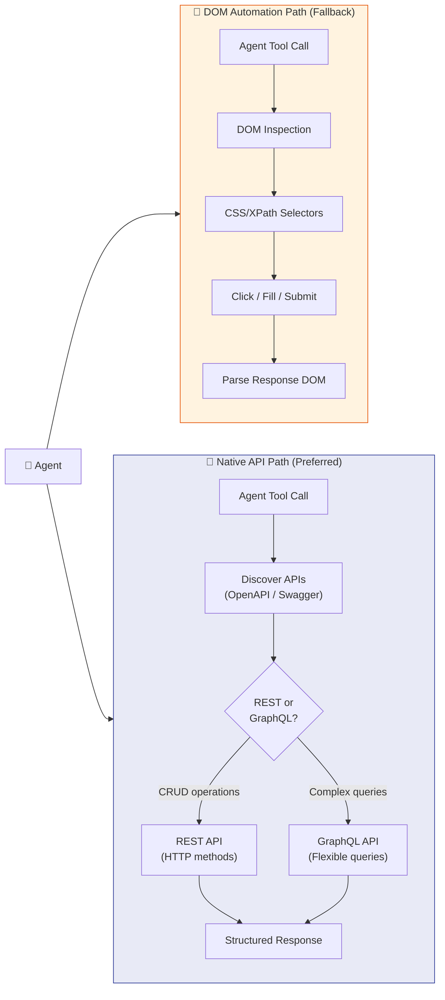

> **Why Native API Integration matters:** Enterprise applications like ServiceNow, Jira, Workday, and Grafana all expose mature REST/GraphQL APIs. By calling these APIs directly, the agent skips brittle DOM scraping and gets structured responses immediately. This is faster, more reliable, and works independently of UI changes — the API contract defines exactly what actions are available and how to invoke them.

## Security Flow

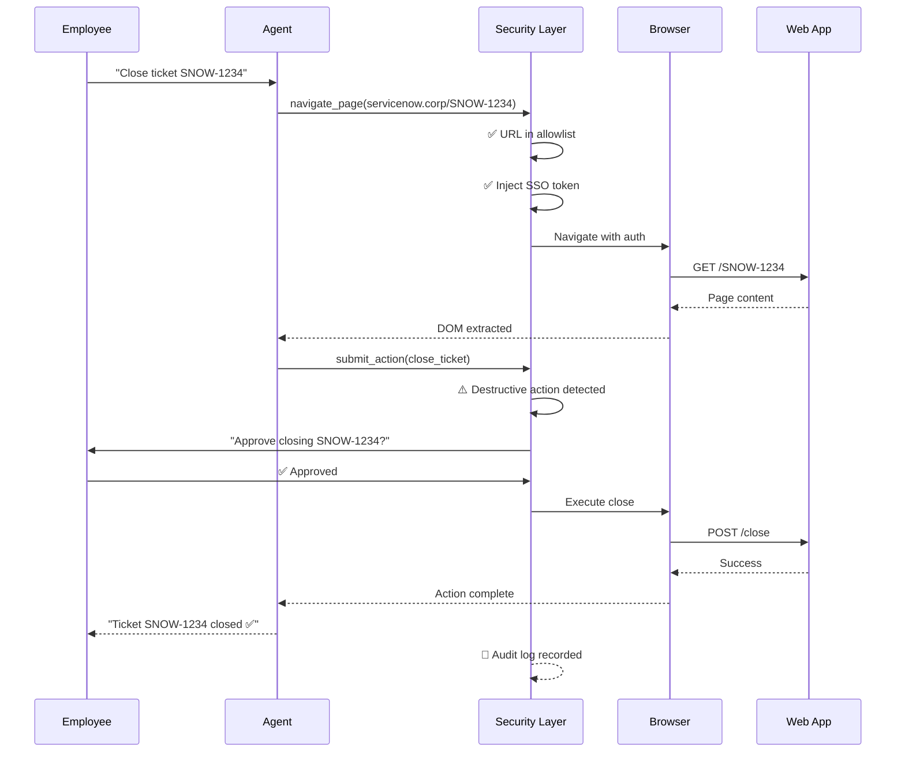

---

## Example 1 — Extract Financial Data from Microsoft Investor Relations

**Scenario:** An analyst asks: _"Go to the Microsoft investor relations page, open the 2024 annual report, and pull the SUMMARY RESULTS OF OPERATIONS table."_

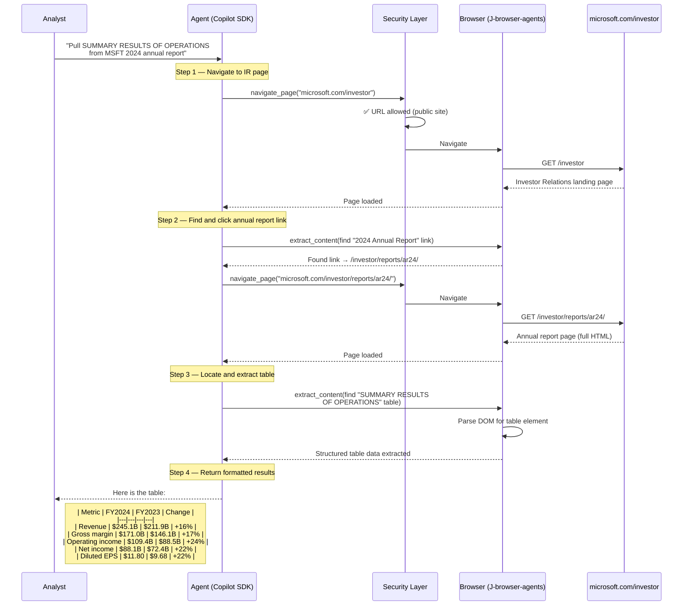

### Expected Extracted Output

| (In millions, except per share) | FY 2024 | FY 2023 | % Change |
|---|---|---|---|
| **Revenue** | $245,122 | $211,915 | 16% |
| **Gross margin** | $171,008 | $146,052 | 17% |
| **Operating income** | $109,433 | $88,523 | 24% |
| **Net income** | $88,136 | $72,361 | 22% |
| **Diluted EPS** | $11.80 | $9.68 | 22% |

---

## Example 2 — Cross-App Incident Resolution (ServiceNow + Jira + Dashboard)

**Scenario:** A site reliability engineer asks: _"There's a P1 incident in ServiceNow INC0042. Link it to the related Jira bug, pull the error rate from our monitoring dashboard, and add it to the incident notes."_

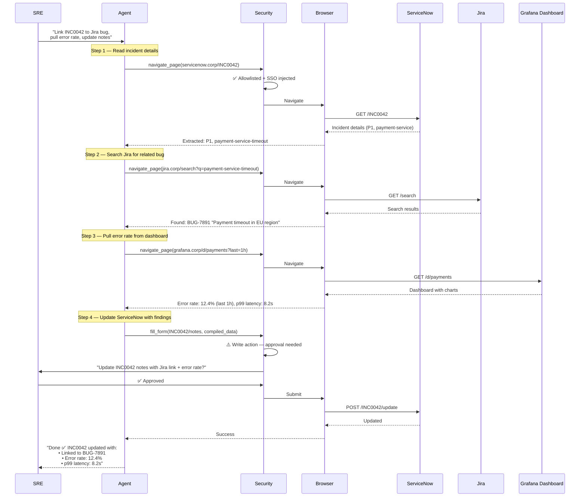

---

## Example 3 — Multi-Step Travel Booking with Native API Integration

**Scenario:** An employee asks: _"Book me the cheapest direct flight from Seattle to New York on March 15, and submit for manager approval."_

This example showcases the **Native API Integration** — the agent discovers the travel portal's REST API via its OpenAPI spec, then uses direct API calls for search, filtering, and booking.

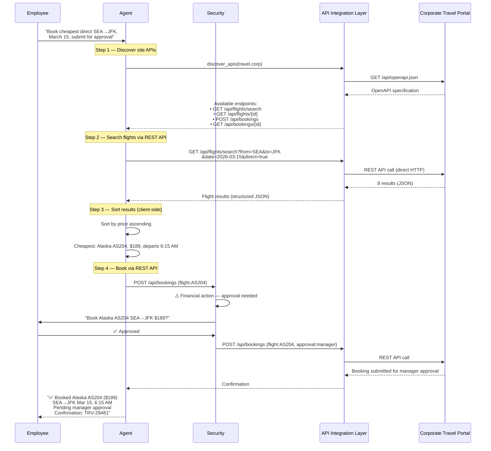

---

## Example 4 — Competitive Intelligence Report from Public SEC Filings

**Scenario:** A strategy analyst asks: _"Compare revenue and operating income for MSFT, GOOGL, and AMZN from their latest annual reports. Build a comparison table."_

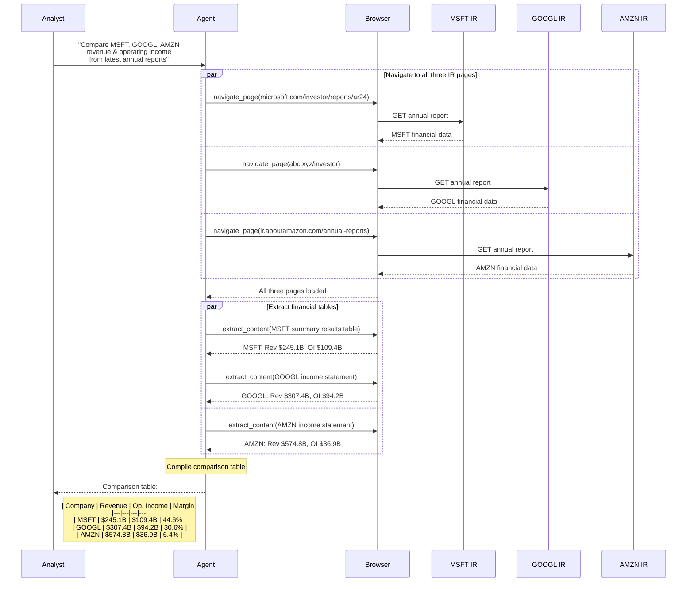

---

## Example 5 — HR Onboarding Workflow Across Multiple Internal Portals

**Scenario:** An HR coordinator asks: _"New hire Jane Doe starts Monday. Create her accounts in Workday, provision Jira access for the Platform team, and assign ServiceNow onboarding tasks."_

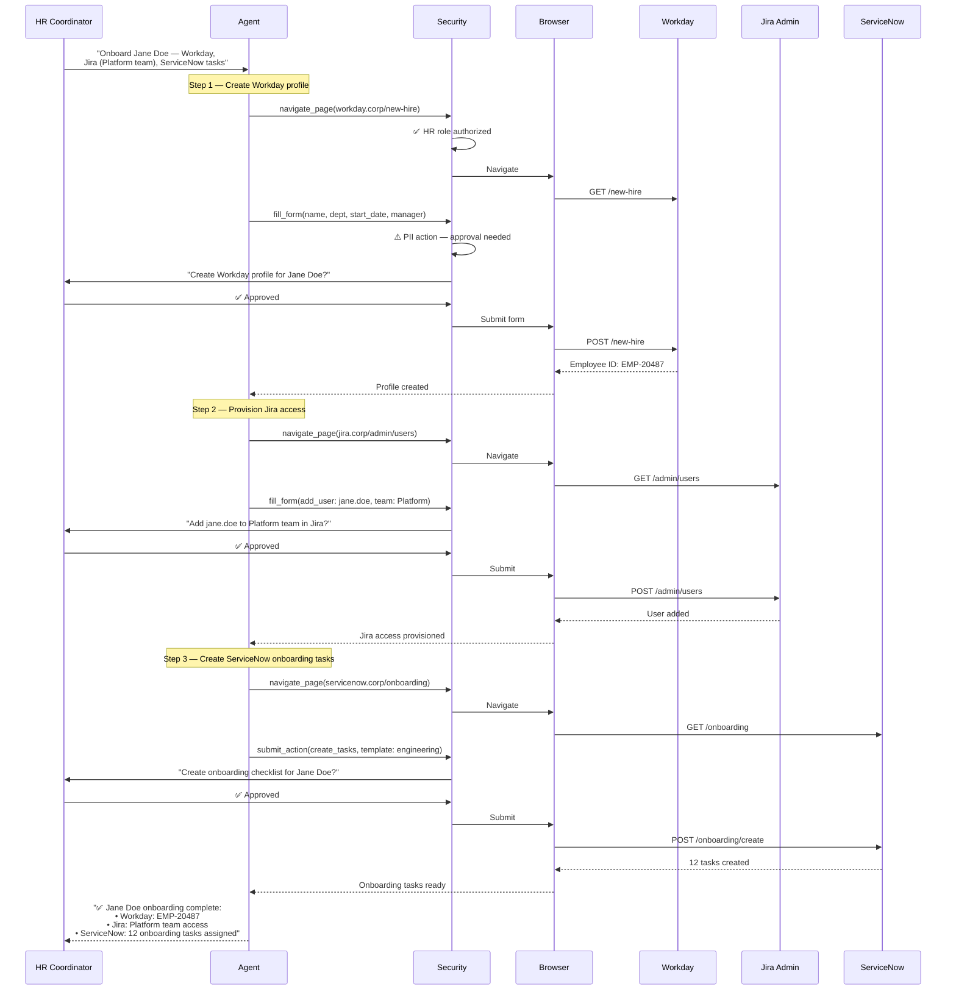

---

## Related Files

- **[README.md](./README.md)** — Executive summary, "Operation Skyfall" demo scenario, Azure integration overview, ROI metrics, Copilot SDK feedback, customer validation
- **[agents.md](./agents.md)** — Agent types, M365 Copilot app packaging, declarative agent manifest, Foundry integration, and API integration strategy
- **[skills.md](./skills.md)** — Detailed skill definitions (`navigate_page`, `extract_content`, `fill_form`, `submit_action`, `discover_apis`, `compare_data`, Microsoft Graph skills), API plugin spec, Azure AI Content Safety integration, and security classifications

---

## Azure Cloud Infrastructure

### Azure OpenAI Service

The agent uses **Azure OpenAI Service (GPT-4o)** as its foundation model for:
- **Task planning** — Decomposing natural language requests into multi-step skill invocation plans
- **Intent recognition** — Mapping user prompts to the correct skills and parameters
- **Response generation** — Synthesizing extracted data into human-readable summaries, tables, and executive briefs
- **Error recovery** — When a skill fails, the model reasons about alternative approaches (e.g., switch from API to DOM path)

### Azure Entra ID

All authentication flows use **Azure Entra ID** with:
- **SSO delegation** — Agent authenticates to target applications using the user's existing SSO session
- **Conditional Access** — Policies enforce device compliance, location restrictions, and MFA requirements
- **RBAC** — Fine-grained role-based access control determines which skills each user can invoke
- **Token scoping** — Tokens are scoped per-application with minimum required permissions

### Azure Container Apps

The agent runtime is hosted on **Azure Container Apps** for:
- **Auto-scaling** — Scales from 0 to N instances based on request volume (KEDA-driven)
- **Revision management** — Blue/green deployments with instant rollback
- **Managed identity** — No credentials in code; authenticates to Azure services via managed identity
- **VNet integration** — Runs inside the corporate VNet for access to internal applications

### Azure Key Vault

All secrets are managed through **Azure Key Vault**:
- SSO tokens and refresh tokens
- API keys for third-party integrations
- Browser session encryption keys
- TLS certificates for internal communication

### Azure Cosmos DB

**Azure Cosmos DB** stores:
- **Immutable audit logs** — Every agent action is logged with timestamp, user, skill, parameters, and result
- **Workflow state** — Multi-step workflow progress and conversation memory
- **Change feed** — Streams audit data to Microsoft Fabric for analytics

### Observability Stack

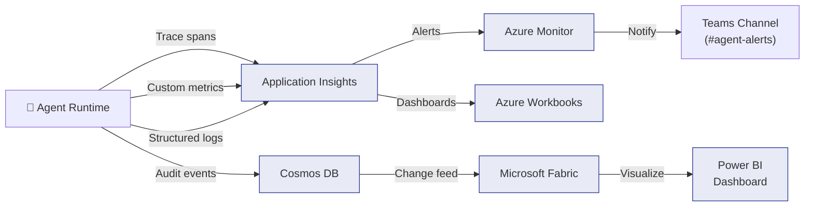

**Application Insights** provides:
- **Distributed tracing** — End-to-end trace from user prompt → Copilot SDK → security gate → browser/API → target app → response
- **Custom metrics** — Skill invocation counts, API vs. DOM path ratio, approval rates, response times
- **Live metrics** — Real-time dashboard showing active sessions, error rate, and throughput
- **Failure analysis** — Automatic detection of skill failures with root cause analysis

**Azure Monitor** provides:
- **Alert rules** — Triggers on error rate > 1%, response time > 10s, approval timeout, Content Safety blocks
- **Action groups** — Sends alerts to Teams channel, email, and PagerDuty
- **SLA tracking** — Custom dashboards tracking agent availability and performance SLAs

---

## Responsible AI Architecture

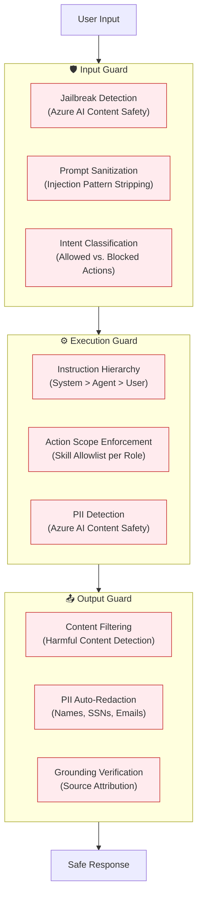

### RAI Principles Applied

| Principle | How We Implement It |
|---|---|
| **Fairness** | Azure AI Content Safety evaluates all agent outputs for bias; agent instructions prohibit discriminatory actions; skill parameters are schema-validated to prevent skewed queries |
| **Transparency** | Every action logged to Cosmos DB with full provenance; users see a step-by-step execution summary; audit trail is queryable by compliance teams |
| **Privacy** | PII auto-detected and redacted via Content Safety; data residency controls per Azure region; screenshot PII masking; no customer data used for model training |
| **Security** | Multi-layer prompt injection defense; jailbreak detection; credential isolation in Key Vault; zero secrets in code; Conditional Access enforcement |
| **Accountability** | Human-in-the-loop approval for ALL write actions; immutable audit trail with tamper detection; Entra ID RBAC with principle of least privilege |
| **Reliability** | Graceful degradation (API → DOM → error message); retry with exponential backoff; health check endpoints; circuit breaker patterns |
| **Inclusiveness** | Agent responses support multiple languages; accessibility-aware output formatting; keyboard-navigable approval prompts in Teams |

---

## Microsoft Foundry & Fabric Integration

### Foundry — Agent Orchestration at Scale

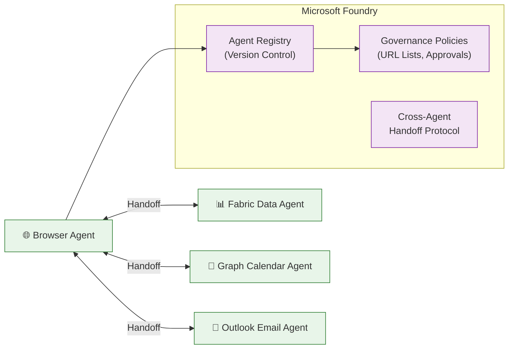

- **Agent Registry** — All browser agent instances are registered, versioned, and governed centrally
- **Cross-Agent Handoff** — The browser agent can delegate sub-tasks to specialized Foundry agents (e.g., hand off analytics to a Fabric data agent)
- **Centralized Governance** — IT admins manage URL allowlists, approval policies, and Content Safety thresholds through the Foundry control plane

### Fabric — Data Intelligence

Agent activity data flows into **Microsoft Fabric** lakehouse for:
- **Usage Analytics** — Skill invocation patterns, most-accessed applications, peak usage times
- **Workflow Optimization** — ML models identify bottleneck steps and suggest faster API paths
- **Cost Analysis** — Azure OpenAI token usage, Container Apps compute, per-workflow ROI
- **Compliance Reporting** — Auto-generated audit reports from Cosmos DB change feed data

### Work IQ — Productivity Intelligence

The agent integrates with **Work IQ** to quantify real productivity impact:

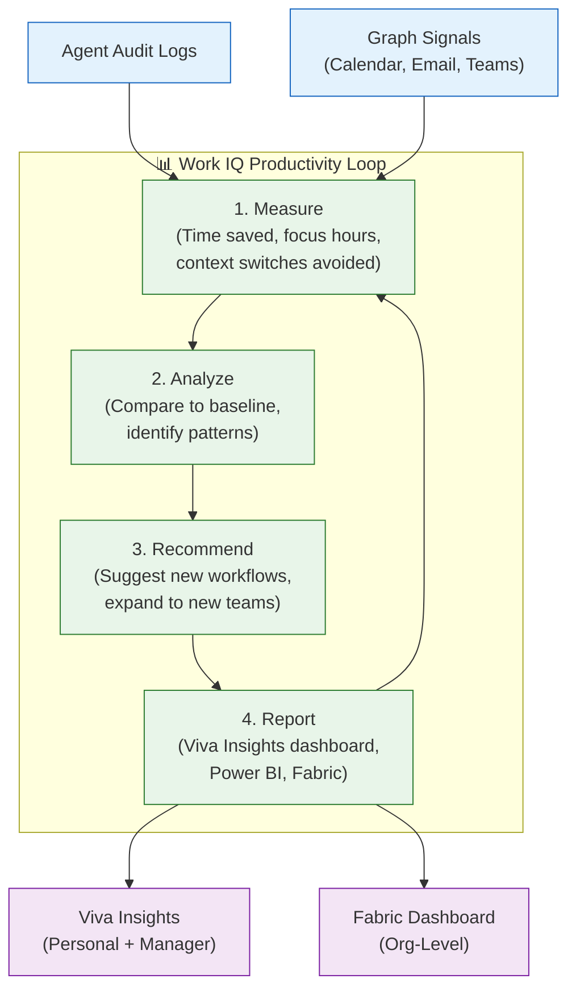

- **Time Intelligence** — Measures actual hours saved per workflow vs. manual baseline (e.g., "Incident resolution saves 39 min per execution")
- **Focus Time Recovery** — Tracks how agent automation frees up uninterrupted deep work blocks (correlates with Microsoft Graph calendar data)
- **Collaboration Velocity** — Measures cross-team handoff speed improvement (e.g., "Cross-app onboarding reduced from 3 days to 45 minutes")
- **Proactive Recommendations** — Surfaces insights like: "Your team's top 3 time-consuming workflows are all automatable — projected savings: 28 hrs/week"
- **Viva Insights Integration** — Productivity metrics surface in employees' personal Viva Insights dashboard and managers' team analytics
