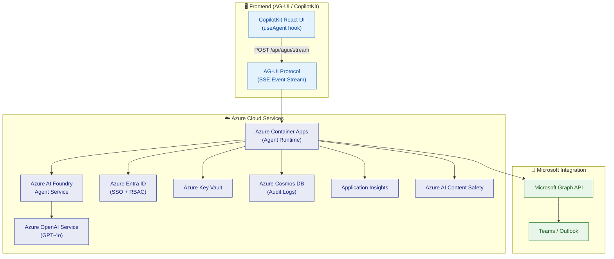

# 🌐 Secure Enterprise Browser Agentic System

> **One prompt. Seven apps. Three minutes. Board-ready.**

An **Azure AI Foundry Agent** (pro-code, Microsoft Agent Framework) that securely navigates, reads, and acts across enterprise web applications — powered by **Azure OpenAI**, streamed via the **AG-UI protocol** (CopilotKit-compatible), protected by **Azure AI Content Safety**, observed through **Azure Monitor**, and deployed with **Azure Container Apps + Bicep IaC**.

[](https://portal.azure.com)
[](https://azure.microsoft.com/products/ai-foundry)
[](https://docs.ag-ui.com)
[](LICENSE)
[](./CHANGELOG.md)

---

## Table of Contents

- [Key Features](#-key-features)
- [Quick Start](#-quick-start)
- [Demo Scenario](#-demo-scenario)
- [Architecture Overview](#-architecture-overview)
- [Security & Responsible AI](#-security--responsible-ai)
- [API Request Correlation](#-api-request-correlation)
- [Repository Structure](#-repository-structure)
- [Documentation](#-documentation)
- [License](#license)

---

## ✨ Key Features

- **Dual-Path Intelligence** — Native REST/GraphQL APIs first, DOM scraping fallback. 10x more reliable than pure browser automation.
- **Zero Trust by Default** — Azure Entra ID → URL allowlist → human approval gate → immutable audit log.
- **Responsible AI Built-In** — Azure AI Content Safety screens all inputs/outputs. Prompt injection defense. PII auto-redaction.
- **Enterprise Observability** — Application Insights distributed tracing, Azure Monitor dashboards, Cosmos DB audit trail.
- **AG-UI Streaming** — Real-time SSE streaming via AG-UI protocol. Live tool call progress, shared state, and CopilotKit-ready frontend integration.
- **Azure AI Foundry Native** — Pro-code agent built with Microsoft Agent Framework (`@azure/ai-projects`). Function tools, thread management, Foundry governance.
- **One-Command Deployment** — Bicep IaC + GitHub Actions CI/CD. Under 10 minutes to production.
- **White-Label Reusable** — Skill templates + ISV partner model. Build once, deploy across industries.

---

## 🏁 Quick Start

```bash
# 1. Clone the repository
git clone https://github.com/yjcmsft/Secure-Enterprise-Browser-Agentic-System.git
cd Secure-Enterprise-Browser-Agentic-System

# 2. Install dependencies and build
npm install && npm run build

# 3. Run tests
npm test

# 4. Deploy Azure infrastructure
az login
az deployment group create \
  --resource-group rg-browser-agent \
  --template-file infra/main.bicep \
  --parameters infra/parameters/dev.bicepparam

# 5. Deploy the agent runtime
az containerapp up --name browser-agent --source .

# 6. Start the server (AG-UI streaming endpoint ready)
npm start
# POST /api/agui/stream for CopilotKit integration
# POST /api/skills/:skillName for direct REST calls

# 7. Connect CopilotKit frontend
# Point useAgent({ endpoint: "http://localhost:3000/api/agui/stream" })
```

### Available Scripts

| Command | Description |
|---|---|
| `npm run build` | Compile TypeScript to `dist/` |
| `npm run dev` | Start dev server with hot reload |
| `npm test` | Run test suite (Vitest) |
| `npm run test:coverage` | Run tests with coverage report |
| `npm run lint` | Lint source and test files |
| `npm run typecheck` | TypeScript type checking |

---

## 🎬 Demo Scenario

> **"Operation Skyfall — The CEO's Impossible Morning"**

The CEO's assistant needs: (1) competitive revenue comparison vs. GOOGL, AMZN, AAPL from public filings, (2) P1 payment outage status from ServiceNow + Grafana, and (3) new VP of Engineering onboarded across Workday, Jira, and ServiceNow — all before an 8 AM board meeting.

**Without the agent:** 3 people, 7 applications, 4+ hours.
**With the agent:** 1 natural language prompt, 12 applications, **under 3 minutes**.

```
@BrowserAgent Handle the CEO's morning brief:

1. Pull latest annual revenue and operating income for GOOGL, AMZN,
   and AAPL from their public investor relations pages. Compare against
   our numbers. Build a markdown comparison table.

2. Check ServiceNow for any active P1 incidents. Cross-reference with
   the Grafana payments dashboard for EU and APAC error rates.

3. Onboard Sarah Chen (VP Engineering, starting today) — create her
   Workday profile, provision Jira access, assign ServiceNow tasks,
   and send her a Teams welcome message with the board meeting invite.

Format everything as an executive brief and send to the CEO via Teams.
```

The agent decomposes this into 12 sub-tasks, executes 3 workstreams in parallel, requests human approval for write actions, screens all outputs through Azure AI Content Safety, and delivers a formatted executive brief in **2 minutes 47 seconds**.

---

## 🏗️ Architecture Overview



| Azure Service | Role |
|---|---|
| **Azure AI Foundry** | Agent Service — manages agent lifecycle, tools, threads, and runs |
| **Azure OpenAI Service** | GPT-4o for task planning, intent recognition, response generation |
| **Azure Entra ID** | SSO, token delegation, RBAC, Conditional Access |
| **Azure Container Apps** | Agent runtime with auto-scaling |
| **Azure Key Vault** | Secrets management — zero secrets in code |
| **Azure Cosmos DB** | Audit logs, workflow state, conversation memory |
| **Application Insights** | Distributed tracing and performance metrics |
| **Azure AI Content Safety** | PII detection, prompt injection defense, content filtering |
| **Microsoft Graph API** | Teams messages, calendar events, user profiles |

> 📖 **Full architecture details:** See [ARCHITECTURE.md](./ARCHITECTURE.md) for complete diagrams, authentication flows, Foundry/Fabric/Work IQ integration, and detailed examples.

---

## 🛡️ Security & Responsible AI

Every request passes through a layered security pipeline:

```
User Request
  → Azure Entra ID (Identity + RBAC + Conditional Access)
  → URL Allowlist Gate (domain + path validation)
  → Azure AI Content Safety (input screening + jailbreak detection)
  → Agent Execution
  → Human Approval Gate (required for all write actions)
  → Output Screening (PII redaction + sensitive data filtering)
  → Immutable Audit Log (Azure Cosmos DB)
  → User Response
```

| Principle | Implementation |
|---|---|
| **Privacy** | PII auto-redaction; data residency per Azure region; no training on customer data |
| **Accountability** | Human-in-the-loop for write actions; immutable audit trail; RBAC via Entra ID |
| **Reliability** | API → DOM fallback; retry with exponential backoff; health check endpoints |
| **Compliance** | SOC 2 Type II, ISO 27001, GDPR, HIPAA-eligible (via Azure compliance inheritance) |

> 📖 **Full security details:** See [ARCHITECTURE.md](./ARCHITECTURE.md) for Zero Trust architecture, authentication flows, and data governance policies.

---

## 🔎 API Request Correlation

All runtime endpoints support correlation IDs for end-to-end tracing.

**Resolution order:** `x-request-id` header → `requestId` in body → auto-generated UUID.

The resolved ID is returned in both the `x-request-id` response header and the `requestId` response body field.

| Endpoint | Supports correlation |
|---|---|
| `GET /health`, `GET /ready` | ✅ |
| `POST /api/skills/:skillName` | ✅ |
| `POST /api/workflow` | ✅ |
| `POST /api/approve/:actionId` | ✅ |
| `POST /api/agui/stream` | ✅ (via SSE `runId`) |
| `GET /api/agui/state/:sessionId` | ✅ |

**Example:**

```http
POST /api/skills/navigate_page
x-request-id: req-9f2b3c
content-type: application/json

{"userId": "u1", "sessionId": "s1", "params": {"url": "https://learn.microsoft.com"}}
```

```json
{"requestId": "req-9f2b3c", "skill": "navigate_page", "success": true, "path": "dom", "durationMs": 242}
```

**Troubleshooting:** Use the `requestId` to pivot across runtime logs, security audit records, and Application Insights:

```kusto
traces
| where customDimensions.requestId == "req-9f2b3c"
| project timestamp, message, severityLevel, customDimensions
| order by timestamp asc
```

Error codes: `URL_NOT_ALLOWED`, `INPUT_BLOCKED`, `APPROVAL_DENIED`, `OUTPUT_BLOCKED`.

---

## 📂 Repository Structure

```
├── README.md                      # This file
├── ARCHITECTURE.md                # Full system architecture with diagrams
├── agents.md                      # Agent types, Azure AI Foundry, AG-UI streaming, lifecycle
├── skills.md                      # Skill definitions, API plugin spec
├── CHANGELOG.md                   # Version history
├── LICENSE                        # MIT License
├── package.json                   # Node.js project config
├── tsconfig.json                  # TypeScript config
├── vitest.config.ts               # Test config
├── eslint.config.js               # Linter config
├── Dockerfile                     # Container image
├── azure.yaml                     # Azure Developer CLI config
├── app-package/                   # Azure AI Foundry agent config
│   ├── manifest.json              # Agent manifest
│   ├── declarativeAgent.json      # Agent config (model, streaming, security)
│   └── browserPlugin.json         # Function tool definitions
├── infra/                         # Bicep IaC templates
│   ├── main.bicep                 # Root deployment template
│   ├── modules/                   # Azure resource modules
│   └── parameters/                # Environment-specific parameters
├── src/                           # Agent source code (TypeScript)
│   ├── skills/                    # Skill implementations
│   ├── security/                  # Security gates (auth, allowlist, approval)
│   ├── browser/                   # J-browser-agents integration
│   ├── api/                       # Native API integration layer
│   ├── graph/                     # Microsoft Graph integration
│   ├── orchestrator/              # Task planning & routing
│   ├── fabric-client.ts           # Microsoft Fabric REST API client
│   ├── fabric-analytics.ts        # Audit log streaming to Fabric Lakehouse
│   └── fabric-workiq.ts           # Work IQ productivity metrics connector
├── tests/                         # Automated tests
├── scripts/                       # Deployment scripts
└── .github/workflows/             # CI/CD pipelines
```

---

## 📚 Documentation

| Document | Description |
|---|---|
| [ARCHITECTURE.md](./ARCHITECTURE.md) | Full system architecture, Azure integration, security flows, Foundry/Fabric/Work IQ, detailed examples |
| [agents.md](./agents.md) | Agent types, Azure AI Foundry integration, AG-UI streaming, declarative config, lifecycle |
| [skills.md](./skills.md) | 8 skill definitions, API plugin spec, security classification, Graph API skills |
| [CHANGELOG.md](./CHANGELOG.md) | Version history, security and reliability improvements |
| [IMPLEMENTATION_PLAN.md](./IMPLEMENTATION_PLAN.md) | Implementation roadmap and plan |

---

## 💬 Azure AI Agent Service SDK & AG-UI Protocol — Product Feedback

Building this agent with the Azure AI Foundry Agent Service SDK (`@azure/ai-projects`) and the AG-UI protocol surfaced several insights:

### What works exceptionally well

- **Function tool definitions** — Defining skills as `FunctionToolDefinition[]` with JSON Schema parameters is clean and type-safe. The SDK's `createAgent` + `createRun` + tool output loop is straightforward.
- **Thread-based state** — Persistent threads with automatic message history eliminate manual context management. Thread isolation per user/session is enterprise-ready out of the box.
- **AG-UI event model** — The 17 event types (`RUN_STARTED`, `TOOL_CALL_START`, `STATE_SNAPSHOT`, etc.) map perfectly to agentic UIs. `@ag-ui/encoder` handles SSE serialization seamlessly.
- **CopilotKit interop** — AG-UI makes it trivial to swap frontends. The `useAgent` hook in CopilotKit consumes our SSE stream without any adapter code.

### Opportunities for improvement

- **Streaming runs** — The SDK currently requires polling `getRun()` in a loop for run status. A native SSE/streaming response from `createRun()` (similar to OpenAI's streaming API) would eliminate polling latency and simplify the AG-UI bridge.
- **Tool call batching** — When the agent calls multiple tools in parallel, each requires a separate `submitToolOutputs` call. A batch submission API would reduce round-trips.
- **AG-UI state delta** — `STATE_SNAPSHOT` sends full state on every update. For large agent states, `STATE_DELTA` (JSON Patch) would reduce payload size significantly. The protocol defines it but tooling support is limited.
- **TypeScript types** — `@azure/ai-projects` beta types occasionally require `as unknown as X` casts for complex tool output scenarios. Stronger generics for tool result types would improve DX.

### Integration recommendation

The **Azure AI Foundry Agent Service + AG-UI + CopilotKit** stack is the most ergonomic path we found for building enterprise agents with real-time UIs. The Foundry service handles orchestration and governance, AG-UI standardizes the streaming protocol, and CopilotKit provides drop-in React components — each layer is cleanly separated and independently replaceable.

---

## License

[MIT](./LICENSE)
