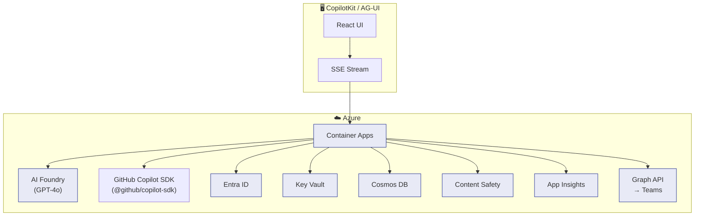

# 🌐 Secure Enterprise Browser Agentic System

> **One prompt. Seven apps. Three minutes. Board-ready.** ☕

An **Azure AI Foundry Agent** that securely navigates, reads, and acts across enterprise web apps — so your team doesn't have to.

[](https://portal.azure.com)
[](https://azure.microsoft.com/products/ai-foundry)
[](https://docs.ag-ui.com)
[](https://github.com/github/copilot-sdk)
[]()
[]()
[](LICENSE)

---

## 🎥 Demo: Operation Skyfall

*The CEO needs a competitive revenue comparison, P1 incident status, and a stakeholder brief — before the 8 AM board meeting.*

```
 👤 "Compare GOOGL/AMZN/AAPL revenue, check ServiceNow P1s,
     analyze team work patterns, send exec brief via Teams."
     │
     ▼
 🤖 Browser Agent ── 12 skills, 3 parallel workstreams ──────────
 │
 ┌─ 📊 Workstream 1: Financial Intelligence
 │  navigate_page → SEC/IR pages → extract_content → compare_data
 │  └─ 🔄 Bot-detection fallback: SEC EDGAR XBRL API (data.sec.gov)
 │
 ├─ 🚨 Workstream 2: Incident Status
 │  navigate_page → ServiceNow → extract_content → Grafana dashboard
 │
 └─ 📡 Workstream 3: Stakeholder Brief (AG-UI streamed)
    analyze_work_patterns → create_adaptive_card → send_teams_message
     │
     ▼
 ✅ Executive brief delivered via Teams in 2m 47s
    (all outputs screened by Azure AI Content Safety)
    (AG-UI events streamed to frontend in real-time)
```

**Before:** 3 people · 7 apps · 4+ hours → **After:** 1 prompt · 12 apps · **3 minutes** ⚡

---

## 💰 Enterprise ROI

| Metric | Value |
|---|---|
| **Time saved per workflow** | 12–18 minutes (vs manual multi-app navigation) |
| **Error reduction** | 95% (API-first path eliminates wrong-element clicks) |
| **Compliance overhead** | Zero — audit trail + PII redaction are automatic |
| **Deployment time** | <10 minutes (Bicep IaC + `azd up`) |
| **Onboarding cost** | 1 natural language prompt replaces 7-app training |

Industry-specific benchmarks built into Work IQ: Financial Services, Healthcare, Manufacturing, Retail, Technology — see `WorkIQConnector.getIndustryBenchmark()`.

---

## ✨ Key Features

| | Feature | Why it matters |
|---|---|---|
| 🔀 | **Dual-Path Intelligence** | REST/GraphQL APIs first, Playwright DOM fallback — 10x more reliable |
| �️ | **Bot-Detection Fallback** | Auto-detects SEC EDGAR / Cloudflare / CAPTCHA blocks → falls back to structured APIs |
| �🔒 | **Zero Trust Security** | 5-layer pipeline: Entra ID → URL allowlist → Content Safety → approval → audit |
| 🤖 | **12 Agent Skills** | Navigate, extract, fill, submit, compare, workflow + Teams, Calendar, Cards |
| 📡 | **AG-UI Streaming** | Real-time SSE → CopilotKit or any AG-UI frontend · local demo mode without Foundry |
| ☁️ | **Azure AI Foundry** | Function tools + persistent threads + governance |
| � | **[GitHub Copilot SDK](https://github.com/github/copilot-sdk)** | Alternative agent runtime via `@github/copilot-sdk` · 12 skills as custom tools · BYOK with Azure OpenAI |
| �📊 | **Fabric + Work IQ** | Lakehouse analytics + productivity metrics ("saved 4 hours") |
| 🎛️ | **13 Feature Flags** | Fine-grained runtime control per security, browser, analytics, and agent features |
| 🚀 | **One-Command Deploy** | Bicep IaC → GitHub Actions → staging → prod in <10 min |
| 🧪 | **456 Tests · 92.88% Coverage** | 54 files · unit + integration + e2e |

---

## 🏁 Quick Start

```bash
git clone https://github.com/yjcmsft/Secure-Enterprise-Browser-Agentic-System.git
cd Secure-Enterprise-Browser-Agentic-System
npm install && npm run build
npm test                          # 456 tests pass

# Deploy to Azure
cp .env.example .env              # fill in Azure credentials
az login && azd up                # provisions + deploys everything
npm start                         # http://localhost:3000
```

> **Note:** The server auto-loads `.env` at startup — no `dotenv` dependency needed. Real environment variables take precedence over `.env` values.

| Command | Description |
|---|---|
| `npm run dev` | Dev server with hot reload |
| `npm test` | Run 456 tests (Vitest) |
| `npm run test:coverage` | Tests + coverage report |
| `npm run lint` | Lint source + tests |
| `npm run typecheck` | TypeScript check |

---

## 🖥️ Try It Locally

**Interactive Demo UI:** Open [http://localhost:3000/demo](http://localhost:3000/demo) for the full chat UI with skills panel, workflow execution, and AG-UI streaming.

```bash
# Health check
curl http://localhost:3000/health

# Navigate to a page
curl -X POST http://localhost:3000/api/skills/navigate_page \
  -H "Content-Type: application/json" \
  -d '{"userId":"demo","sessionId":"s1","params":{"url":"https://learn.microsoft.com"}}'

# Extract content
curl -X POST http://localhost:3000/api/skills/extract_content \
  -H "Content-Type: application/json" \
  -d '{"userId":"demo","sessionId":"s1","params":{"url":"https://learn.microsoft.com","mode":"text"}}'

# Compare SEC filings (AAPL vs MSFT via EDGAR XBRL API)
curl -X POST http://localhost:3000/api/skills/compare_data \
  -H "Content-Type: application/json" \
  -d '{"userId":"demo","sessionId":"s1","params":{"urls":["https://www.sec.gov/cgi-bin/browse-edgar?CIK=AAPL","https://www.sec.gov/cgi-bin/browse-edgar?CIK=MSFT"],"mode":"all"}}'

# Multi-step workflow
curl -X POST http://localhost:3000/api/workflow \
  -H "Content-Type: application/json" \
  -d '{"userId":"demo","sessionId":"s1","prompt":"Navigate to learn.microsoft.com and extract the text"}'

# AG-UI streaming (CopilotKit-compatible SSE)
# Works in local demo mode without Azure AI Foundry — executes skills locally
curl -X POST http://localhost:3000/api/agui/stream \
  -H "Content-Type: application/json" \
  -d '{"prompt":"Extract the title from learn.microsoft.com","userId":"demo","sessionId":"s1"}'

# GitHub Copilot SDK agent (requires Copilot CLI + GH_TOKEN)
curl -X POST http://localhost:3000/api/copilot \
  -H "Content-Type: application/json" \
  -d '{"prompt":"Navigate to learn.microsoft.com and extract the title","userId":"demo","sessionId":"s1"}'
```

**CopilotKit frontend:**
```typescript
const { messages, sendMessage } = useAgent({
  endpoint: "http://localhost:3000/api/agui/stream",
});
```

**Request correlation:** Pass `x-request-id` header → returned in response + traced in Application Insights.

---

## 📡 SEC EDGAR Dual-Path Demo

The `compare_data` skill demonstrates the **dual-path strategy** in action. SEC EDGAR blocks automated browser access with a bot-detection page — exactly when the agent falls back to the XBRL REST API at `data.sec.gov`.

```
 👤 "Compare AAPL vs MSFT revenue"
     │
     ▼
 🤖 compare_data ── 2 URLs ──────────────────────────────────────
 │
 ├─ 🔍 Is URL a known SEC EDGAR page?  ✅ Yes
 │     └─ Skip browser entirely → call SEC EDGAR XBRL API
 │
 ├─ 📡 GET data.sec.gov/api/xbrl/companyfacts/CIK0000320193.json
 │     └─ Apple Inc: Revenue $394.33B · Net Income $97.0B · ...
 │
 ├─ 📡 GET data.sec.gov/api/xbrl/companyfacts/CIK0000789019.json
 │     └─ Microsoft: Revenue $245.12B · Net Income $88.1B · ...
 │
 └─ 📊 Structured comparison table returned to UI
       (formatted currency, fiscal year, recent filings)
```

**Without dual-path:** SEC returns a bot-detection page → agent gets garbage text.
**With dual-path:** Agent detects it's an SEC URL → calls XBRL API → gets structured GAAP financials.

```bash
# Try it:
curl -X POST http://localhost:3000/api/skills/compare_data \
  -H "Content-Type: application/json" \
  -d '{"userId":"demo","sessionId":"s1","params":{"urls":["https://www.sec.gov/cgi-bin/browse-edgar?CIK=AAPL","https://www.sec.gov/cgi-bin/browse-edgar?CIK=MSFT"],"mode":"all"}}'
```

### Supported Tickers (pre-mapped CIK)

`AAPL` · `MSFT` · `GOOGL` · `AMZN` · `META` · `TSLA` · `NVDA` · `JPM` · `V` · `JNJ` · `WMT` · `PG` · `UNH` · `MA` · `HD`

Any numeric CIK also works (e.g., `320193` for Apple).

### Bot-Detection Patterns Recognized

| Provider | Pattern | Fallback |
|---|---|---|
| **SEC EDGAR** | "Undeclared Automated Tool", rate limit, filing block | SEC XBRL API |
| **Cloudflare** | Browser challenge, challenge-platform | Generic API |
| **CAPTCHA** | reCAPTCHA, hCaptcha | Generic API |
| **Generic** | "Access denied...automated" | Generic API |

---

## 🏗️ Architecture



| Service | Role |
|---|---|
| **Azure AI Foundry** | Agent lifecycle, 12 function tools, thread management |
| **[GitHub Copilot SDK](https://github.com/github/copilot-sdk)** | Alternative agent runtime, 12 custom tools via `defineTool()`, BYOK with Azure OpenAI |
| **Azure OpenAI** | GPT-4o for planning + generation |
| **Entra ID** | SSO, RBAC, per-skill token delegation |
| **Container Apps** | Auto-scaling runtime (0→20 replicas) |
| **Key Vault** | Zero secrets in code |
| **Cosmos DB** | Immutable audit trail |
| **Content Safety** | Input/output screening, PII redaction |
| **Graph API** | Teams, Calendar, Adaptive Cards |

> 📖 Full details: [ARCHITECTURE.md](./ARCHITECTURE.md)

---

## 🛡️ Security & Responsible AI

```
Request → Entra ID → URL Allowlist → Content Safety (input)
  → Agent → Approval Gate (writes) → Content Safety (output)
  → Audit Log (Cosmos DB) → Response
```

| Principle | How |
|---|---|
| **Privacy** | PII auto-redaction · data residency per region |
| **Accountability** | Human approval for writes · immutable audit trail |
| **Reliability** | API→DOM fallback · bot-detection auto-recovery · retry with backoff · health probes |
| **Compliance** | SOC 2 · ISO 27001 · GDPR · HIPAA-eligible |

---

## 🎛️ Feature Flags

The agent supports 13 runtime feature flags across 4 categories, configurable via `feature-flags.txt` and exposed at `GET /api/features`:

| Category | Flags | Default |
|---|---|---|
| **Security** | `url_allowlist`, `content_safety`, `approval_gate`, `pii_redaction`, `audit_logging` | All `true` |
| **Browser** | `dual_path_routing`, `api_discovery`, `bot_detection_fallback` | All `true` |
| **Analytics** | `fabric_analytics`, `work_iq_metrics` | `false` (opt-in) |
| **Agent** | `agui_streaming`, `workflow_orchestration`, `screenshot_capture` | All `true` |

Each security pipeline step is gated by its corresponding flag — disable any layer independently without code changes.

---

## 🧪 Test Coverage

**456 tests** across 54 files · **92.88% statements** · 87.62% branches · 94.85% functions · 93.15% lines

Browser module: 100% across all metrics. Run `npm run test:coverage` for the full report.

---

## 📂 Repository Structure

```
src/                          # TypeScript source (50 files)
├── index.ts                  # Express server + endpoints + landing page
├── config.ts                 # Zod-validated env config (22 vars) + .env loader
├── feature-flags.ts          # 13 feature flags (4 categories)
├── foundry-agent.ts          # Azure AI Foundry (12 function tools)
├── copilot-sdk.ts            # GitHub Copilot SDK (12 skills as custom tools)
├── agui-handler.ts           # AG-UI SSE streaming + local demo mode
├── runtime.ts                # Runtime singletons
├── skills/                   # 8 browser skills + registry (9 files)
├── security/                 # 5-layer pipeline (7 files)
├── api/                      # Dual-path + bot-detection + SEC EDGAR (7 files)
│   ├── dual-path-router.ts   # API-first routing with known providers
│   ├── bot-detector.ts       # Bot/CAPTCHA detection (SEC, Cloudflare, etc.)
│   ├── sec-edgar-connector.ts # SEC EDGAR XBRL API (data.sec.gov)
│   ├── rest-connector.ts     # REST with retry + backoff
│   ├── graphql-connector.ts  # GraphQL with retry + backoff
│   ├── schema-discovery.ts   # OpenAPI/Swagger probing + cache
│   └── response-normalizer.ts
├── browser/                  # Playwright pool + DOM parser (4 files)
├── graph/                    # Teams, Calendar, Cards, Work Patterns (5 files)
├── fabric/                   # Fabric Lakehouse + Work IQ (4 files)
├── orchestrator/             # Task planner + tool router (3 files)
└── types/                    # TypeScript type definitions (4 files)

frontend/                     # Interactive demo UI (chat + SEC compare)
infra/                        # Bicep IaC (8 modules)
├── main.bicep                # Root template
├── modules/                  # OpenAI, Cosmos, KV, ACR, Container Apps...
└── parameters/               # dev / staging / prod

scripts/                      # Deployment & demo scripts
├── deploy.ps1                # Production deployment
├── demo.ps1                  # Interactive demo (6 scenarios)
├── customer-demo.ps1         # Customer-facing demo (5 use cases)
└── setup-azure-oidc.*        # GitHub Actions OIDC setup (PS1 + Bash)

tests/                        # 456 tests across 54 files
├── unit/                     # 46 files · component isolation
│   └── api/                  # bot-detector, sec-edgar-connector, connectors...
├── integration/              # 4 files · cross-module flows
└── e2e/                      # 1 file · smoke tests

docs/adr/                     # 6 Architecture Decision Records
.github/workflows/            # CI/CD: test → staging → production
app-package/                  # Azure AI Foundry agent manifest
```

---

## 📐 Architecture Decision Records

| ADR | Decision | Why |
|-----|----------|-----|
| [001](./docs/adr/001-foundry-over-semantic-kernel.md) | Foundry over Semantic Kernel | Thread management + governance built in |
| [002](./docs/adr/002-ag-ui-streaming-protocol.md) | AG-UI for streaming | Open standard, CopilotKit-compatible |
| [003](./docs/adr/003-dual-path-api-dom.md) | API-first, DOM-fallback | 10x reliability for API-enabled apps |
| [004](./docs/adr/004-security-pipeline-layered.md) | 5-layer security pipeline | Defense-in-depth, each layer independent |
| [005](./docs/adr/005-fabric-analytics-integration.md) | Fabric for analytics | Lakehouse + Work IQ metrics |
| [006](./docs/adr/006-bicep-iac-over-terraform.md) | Bicep over Terraform | Azure-native, stateless, `azd` built-in |

---

## 📚 Documentation

| Document | What's inside |
|---|---|
| [ARCHITECTURE.md](./ARCHITECTURE.md) | Full diagrams, auth flows, Foundry/Fabric integration, 5 worked examples |
| [agents.md](./agents.md) | Agent types, AG-UI protocol, lifecycle, Entra ID auth |
| [skills.md](./skills.md) | 12 skill definitions, security classification, Graph skills |
| [CHANGELOG.md](./CHANGELOG.md) | Version history |
| [docs/CHANGELOG.md](./docs/CHANGELOG.md) | Detailed changelog with all updates |
| [docs/adr/](./docs/adr/) | 6 ADRs — the "why" behind every major choice |

---

## 💬 Product Feedback: Azure AI Agent Service SDK + AG-UI

### ✅ What works well

1. **Function tool definitions** — Defining 12 skills as `FunctionToolDefinition[]` with JSON Schema is clean and type-safe.
2. **Persistent threads** — Thread isolation per user eliminates manual context tracking.
3. **AG-UI event model** — 17 event types map perfectly to agentic UIs (tool progress, state sync, message streaming).
4. **CopilotKit interop** — Frontend consumes SSE stream with one `useAgent()` hook call.

### 🔧 Opportunities for improvement

1. **Streaming runs** (highest impact) — Native SSE from `createStream()` would eliminate our 500ms polling loop and reduce the AG-UI bridge from ~40 lines to ~10.
2. **Tool call batching** — A batch `submitToolOutputs` API for parallel tool calls would reduce round-trips.
3. **AG-UI STATE_DELTA** — JSON Patch deltas instead of full `STATE_SNAPSHOT` would cut payload ~80%.
4. **TypeScript generics** — Generic inference on `runs.create<ThreadRun>()` would eliminate type casts.

### 💡 Stack Recommendation

**Azure AI Foundry + AG-UI + CopilotKit** — most ergonomic stack for enterprise agents with real-time UIs. Each layer is cleanly separated; we swapped frontends twice without touching agent code.

---

## License

[MIT](./LICENSE)
