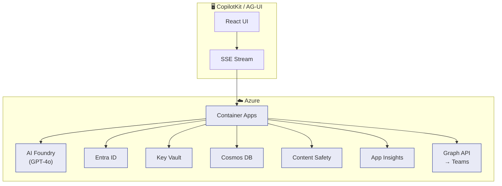

# 🌐 Secure Enterprise Browser Agentic System

> **One prompt. Seven apps. Three minutes. Board-ready.** ☕

An **Azure AI Foundry Agent** that securely navigates, reads, and acts across enterprise web apps — so your team doesn't have to.

[](https://portal.azure.com)
[](https://azure.microsoft.com/products/ai-foundry)
[](https://docs.ag-ui.com)
[]()
[](LICENSE)

---

## 🎥 Demo: Operation Skyfall

*The CEO needs a competitive revenue comparison, P1 incident status, and a new VP onboarded — before the 8 AM board meeting.*

```
 👤 "Compare GOOGL/AMZN/AAPL revenue, check ServiceNow P1s,
     onboard Sarah Chen as VP Eng, send exec brief via Teams."
     │
     ▼
 🤖 Browser Agent ── 12 skills, 3 parallel workstreams ──────────
 │
 ├─ 📊 Workstream 1: Financial Intelligence
 │  navigate_page → SEC/IR pages → extract_content → compare_data
 │
 ├─ 🚨 Workstream 2: Incident Status
 │  navigate_page → ServiceNow → extract_content → Grafana dashboard
 │
 └─ 👩‍💼 Workstream 3: HR Onboarding (⚠️ approval required)
    fill_form → Workday │ fill_form → Jira │ send_teams_message
     │
     ▼
 ✅ Executive brief delivered via Teams in 2m 47s
    (all outputs screened by Azure AI Content Safety)
```

**Before:** 3 people · 7 apps · 4+ hours → **After:** 1 prompt · 12 apps · **3 minutes** ⚡

---

## ✨ Key Features

| | Feature | Why it matters |
|---|---|---|
| 🔀 | **Dual-Path Intelligence** | REST/GraphQL APIs first, Playwright DOM fallback — 10x more reliable |
| 🔒 | **Zero Trust Security** | 5-layer pipeline: Entra ID → URL allowlist → Content Safety → approval → audit |
| 🤖 | **12 Agent Skills** | Navigate, extract, fill, submit, compare, workflow + Teams, Calendar, Cards |
| 📡 | **AG-UI Streaming** | Real-time SSE → CopilotKit or any AG-UI frontend |
| ☁️ | **Azure AI Foundry** | Function tools + persistent threads + governance |
| 📊 | **Fabric + Work IQ** | Lakehouse analytics + productivity metrics ("saved 4 hours") |
| 🚀 | **One-Command Deploy** | Bicep IaC → GitHub Actions → staging → prod in <10 min |
| 🧪 | **392 Tests** | 52 files · unit + integration + e2e |

---

## 🏁 Quick Start

```bash
git clone https://github.com/yjcmsft/Secure-Enterprise-Browser-Agentic-System.git
cd Secure-Enterprise-Browser-Agentic-System
npm install && npm run build
npm test                          # 392 tests pass

# Deploy to Azure
cp .env.example .env              # fill in Azure credentials
az login && azd up                # provisions + deploys everything
npm start                         # http://localhost:3000
```

| Command | Description |
|---|---|
| `npm run dev` | Dev server with hot reload |
| `npm test` | Run 392 tests (Vitest) |
| `npm run test:coverage` | Tests + coverage report |
| `npm run lint` | Lint source + tests |
| `npm run typecheck` | TypeScript check |

---

## 🖥️ Try It Locally

```bash
# Health check
curl http://localhost:3000/health

# Navigate to a page
curl -X POST http://localhost:3000/api/skills/navigate_page \
  -H "Content-Type: application/json" \
  -d '{"userId":"demo","sessionId":"s1","params":{"url":"https://learn.microsoft.com"}}'

# Extract content
curl -X POST http://localhost:3000/api/skills/extract_content \
  -H "Content-Type: application/json" \
  -d '{"userId":"demo","sessionId":"s1","params":{"url":"https://learn.microsoft.com","mode":"text"}}'

# Multi-step workflow
curl -X POST http://localhost:3000/api/workflow \
  -H "Content-Type: application/json" \
  -d '{"userId":"demo","sessionId":"s1","prompt":"Navigate to learn.microsoft.com and extract the text"}'

# AG-UI streaming (CopilotKit-compatible SSE)
curl -X POST http://localhost:3000/api/agui/stream \
  -H "Content-Type: application/json" \
  -d '{"prompt":"Extract the title from learn.microsoft.com","userId":"demo","sessionId":"s1"}'
```

**CopilotKit frontend:**
```typescript
const { messages, sendMessage } = useAgent({
  endpoint: "http://localhost:3000/api/agui/stream",
});
```

**Request correlation:** Pass `x-request-id` header → returned in response + traced in Application Insights.

---

## 🏗️ Architecture



| Service | Role |
|---|---|
| **Azure AI Foundry** | Agent lifecycle, 12 function tools, thread management |
| **Azure OpenAI** | GPT-4o for planning + generation |
| **Entra ID** | SSO, RBAC, per-skill token delegation |
| **Container Apps** | Auto-scaling runtime (0→20 replicas) |
| **Key Vault** | Zero secrets in code |
| **Cosmos DB** | Immutable audit trail |
| **Content Safety** | Input/output screening, PII redaction |
| **Graph API** | Teams, Calendar, Adaptive Cards |

> 📖 Full details: [ARCHITECTURE.md](./ARCHITECTURE.md)

---

## 🛡️ Security & Responsible AI

```
Request → Entra ID → URL Allowlist → Content Safety (input)
  → Agent → Approval Gate (writes) → Content Safety (output)
  → Audit Log (Cosmos DB) → Response
```

| Principle | How |
|---|---|
| **Privacy** | PII auto-redaction · data residency per region |
| **Accountability** | Human approval for writes · immutable audit trail |
| **Reliability** | API→DOM fallback · retry with backoff · health probes |
| **Compliance** | SOC 2 · ISO 27001 · GDPR · HIPAA-eligible |

---

## 📂 Repository Structure

```
src/                          # TypeScript source (45 files)
├── index.ts                  # Express server + endpoints
├── foundry-agent.ts          # Azure AI Foundry (12 function tools)
├── agui-handler.ts           # AG-UI SSE streaming
├── skills/                   # 8 browser skills + registry
├── security/                 # 5-layer pipeline (7 modules)
├── api/                      # Dual-path: REST/GraphQL + DOM
├── browser/                  # Playwright pool + DOM parser
├── graph/                    # Teams, Calendar, Cards, Work Patterns
├── fabric/                   # Fabric Lakehouse + Work IQ
└── orchestrator/             # Task planner + tool router

infra/                        # Bicep IaC (8 modules)
├── main.bicep                # Root template
├── modules/                  # OpenAI, Cosmos, KV, ACR, Container Apps...
└── parameters/               # dev / staging / prod

tests/                        # 392 tests across 52 files
├── unit/                     # Component isolation
├── integration/              # Cross-module flows
└── e2e/                      # Smoke tests

docs/adr/                     # 6 Architecture Decision Records
.github/workflows/            # CI/CD: test → staging → production
app-package/                  # Azure AI Foundry agent manifest
```

---

## 📐 Architecture Decision Records

| ADR | Decision | Why |
|-----|----------|-----|
| [001](./docs/adr/001-foundry-over-semantic-kernel.md) | Foundry over Semantic Kernel | Thread management + governance built in |
| [002](./docs/adr/002-ag-ui-streaming-protocol.md) | AG-UI for streaming | Open standard, CopilotKit-compatible |
| [003](./docs/adr/003-dual-path-api-dom.md) | API-first, DOM-fallback | 10x reliability for API-enabled apps |
| [004](./docs/adr/004-security-pipeline-layered.md) | 5-layer security pipeline | Defense-in-depth, each layer independent |
| [005](./docs/adr/005-fabric-analytics-integration.md) | Fabric for analytics | Lakehouse + Work IQ metrics |
| [006](./docs/adr/006-bicep-iac-over-terraform.md) | Bicep over Terraform | Azure-native, stateless, `azd` built-in |

---

## 📚 Documentation

| Document | What's inside |
|---|---|
| [ARCHITECTURE.md](./ARCHITECTURE.md) | Full diagrams, auth flows, Foundry/Fabric integration, 5 worked examples |
| [agents.md](./agents.md) | Agent types, AG-UI protocol, lifecycle, Entra ID auth |
| [skills.md](./skills.md) | 12 skill definitions, security classification, Graph skills |
| [CHANGELOG.md](./CHANGELOG.md) | Version history |
| [docs/adr/](./docs/adr/) | 6 ADRs — the "why" behind every major choice |

---

## 💬 Product Feedback: Azure AI Agent Service SDK + AG-UI

### ✅ What works well

- **Function tools** — `FunctionToolDefinition[]` with JSON Schema is clean and type-safe
- **Persistent threads** — automatic message history, per-user isolation
- **AG-UI events** — 17 event types map perfectly to agentic UIs
- **CopilotKit interop** — `useAgent` consumes our SSE stream with zero adapter code

### 🔧 Opportunities

- **Streaming runs** — polling `getRun()` is needed today; native SSE from `createRun()` would eliminate latency
- **Tool call batching** — parallel tool calls need separate `submitToolOutputs` calls; batch API would help
- **STATE_DELTA** — full snapshots on every update; JSON Patch deltas would reduce payload
- **TypeScript types** — occasional `as unknown as X` casts needed for complex tool outputs

### 💡 Recommendation

**Azure AI Foundry + AG-UI + CopilotKit** is the most ergonomic stack for enterprise agents with real-time UIs. Each layer is cleanly separated and independently replaceable.

---

## License

[MIT](./LICENSE)
