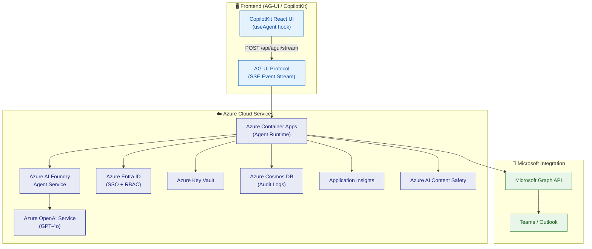

# 🌐 Secure Enterprise Browser Agentic System

> **One prompt. Seven apps. Three minutes. Board-ready.** ☕

An **Azure AI Foundry Agent** that securely navigates, reads, and acts across enterprise web applications — so your team doesn't have to.

Built with the **Microsoft Agent Framework**, streamed via **AG-UI** (CopilotKit-compatible), protected by **Azure AI Content Safety**, and deployed to **Azure Container Apps** with full Bicep IaC.

[](https://portal.azure.com)
[](https://azure.microsoft.com/products/ai-foundry)
[](https://docs.ag-ui.com)
[]()
[](LICENSE)

---

## 🎥 Demo: Operation Skyfall

> *The CEO's assistant needs a competitive revenue comparison, P1 incident status, and a new VP onboarded — all before the 8 AM board meeting.*

```
┌─────────────────────────────────────────────────────────────────┐
│  👤 User                                                        │
│  "Handle the CEO's morning brief: compare GOOGL/AMZN/AAPL      │
│   revenue, check ServiceNow P1s, onboard Sarah Chen as VP Eng, │
│   and send the exec brief to the CEO via Teams."                │
└──────────────────────────┬──────────────────────────────────────┘
                           │
                           ▼
┌──────────────────────────────────────────────────────────────────┐
│  🤖 Browser Agent (12 skills, 3 parallel workstreams)           │
│                                                                  │
│  ┌─ Workstream 1 ──────────────────────────────────────────┐    │
│  │ navigate_page → SEC/IR pages for GOOGL, AMZN, AAPL     │    │
│  │ extract_content → annual revenue + operating income     │    │
│  │ compare_data → build markdown comparison table          │    │
│  └─────────────────────────────────────────────────────────┘    │
│                                                                  │
│  ┌─ Workstream 2 ──────────────────────────────────────────┐    │
│  │ navigate_page → ServiceNow incident dashboard           │    │
│  │ extract_content → active P1 incidents                   │    │
│  │ navigate_page → Grafana payments dashboard              │    │
│  │ extract_content → EU/APAC error rates                   │    │
│  └─────────────────────────────────────────────────────────┘    │
│                                                                  │
│  ┌─ Workstream 3 ──────────────────────────────────────────┐    │
│  │ fill_form → Workday profile (⚠️ approval required)      │    │
│  │ fill_form → Jira access provisioning                    │    │
│  │ submit_action → ServiceNow task assignment              │    │
│  │ send_teams_message → welcome + board meeting invite     │    │
│  └─────────────────────────────────────────────────────────┘    │
│                                                                  │
│  📊 Result: Executive brief delivered via Teams                 │
│  ⏱️  Total time: 2 minutes 47 seconds                          │
│  🛡️  All outputs screened by Azure AI Content Safety           │
└──────────────────────────────────────────────────────────────────┘
```

**Without the agent:** 3 people, 7 apps, 4+ hours.
**With the agent:** 1 prompt, 12 apps, **under 3 minutes**. ⚡

---

## Table of Contents

- [Demo: Operation Skyfall](#-demo-operation-skyfall)
- [Key Features](#-key-features)
- [Quick Start](#-quick-start)
- [Local Development Demo](#%EF%B8%8F-local-development-demo)
- [Architecture Overview](#%EF%B8%8F-architecture-overview)
- [Security & Responsible AI](#%EF%B8%8F-security--responsible-ai)
- [Repository Structure](#-repository-structure)
- [Architecture Decision Records](#-architecture-decision-records)
- [Documentation](#-documentation)
- [Product Feedback](#-azure-ai-agent-service-sdk--ag-ui-protocol--product-feedback)
- [License](#license)

---

## ✨ Key Features

| Feature | What it does | Why it matters |
|---|---|---|
| 🔀 **Dual-Path Intelligence** | Native REST/GraphQL APIs first, DOM scraping fallback | 10x more reliable than pure browser automation |
| 🔒 **Zero Trust Security** | 5-layer pipeline: Entra ID → URL allowlist → Content Safety → approval gate → audit log | Every action is authorized, screened, and auditable |
| 🤖 **12 Agent Skills** | Navigate, extract, fill, submit, screenshot, compare, workflow, discover APIs + Teams, Calendar, Adaptive Cards, Work Patterns | One agent covers read, write, and collaboration |
| 📡 **AG-UI Streaming** | Real-time SSE with 17 event types | Live tool call progress in CopilotKit or any AG-UI frontend |
| ☁️ **Azure AI Foundry Native** | `@azure/ai-projects` with function tools + persistent threads | Enterprise governance, compliance, and observability built in |
| 📊 **Fabric Analytics + Work IQ** | Lakehouse streaming, productivity metrics, time-saved calculations | Measure ROI: "this workflow saved 4 hours" |
| 🚀 **One-Command Deploy** | Bicep IaC + GitHub Actions CI/CD → staging → production | Under 10 minutes to production with `azd up` |
| 🧪 **392 Tests** | Unit + integration + e2e across 52 test files | Confidence to ship daily |

---

## 🏁 Quick Start

```bash
# 1. Clone the repository
git clone https://github.com/yjcmsft/Secure-Enterprise-Browser-Agentic-System.git
cd Secure-Enterprise-Browser-Agentic-System

# 2. Install dependencies and build
npm install && npm run build

# 3. Run tests
npm test

# 4. Deploy Azure infrastructure
az login
az deployment group create \
  --resource-group rg-browser-agent \
  --template-file infra/main.bicep \
  --parameters infra/parameters/dev.bicepparam

# 5. Deploy the agent runtime
az containerapp up --name browser-agent --source .

# 6. Start the server (AG-UI streaming endpoint ready)
npm start
# POST /api/agui/stream for CopilotKit integration
# POST /api/skills/:skillName for direct REST calls

# 7. Connect CopilotKit frontend
# Point useAgent({ endpoint: "http://localhost:3000/api/agui/stream" })
```

### Available Scripts

| Command | Description |
|---|---|
| `npm run build` | Compile TypeScript to `dist/` |
| `npm run dev` | Start dev server with hot reload |
| `npm test` | Run test suite (Vitest) |
| `npm run test:coverage` | Run tests with coverage report |
| `npm run lint` | Lint source and test files |
| `npm run typecheck` | TypeScript type checking |

---

## 🖥️ Local Development Demo

Run the agent locally and interact with every endpoint using `curl`.

### 1. Setup & Start

```bash
# Install dependencies
npm install

# Copy environment template and fill in your values
cp .env.example .env
# Edit .env with your Azure credentials (see .env.example for guidance)

# Build and start the server
npm run build
npm start
# Server starts at http://localhost:3000
```

Or use hot-reload for development:

```bash
npm run dev
```

### 2. Health & Readiness

```bash
# Health check
curl http://localhost:3000/health
# {"requestId":"...","status":"healthy"}

# Readiness check (verifies browser pool, Key Vault, audit store)
curl http://localhost:3000/ready
# {"requestId":"...","status":"ready","dependencies":{"browser":"ready",...}}
```

### 3. Invoke Skills Directly

Each of the 8 browser skills can be called via `POST /api/skills/:skillName`:

```bash
# Navigate to a page
curl -X POST http://localhost:3000/api/skills/navigate_page \
  -H "Content-Type: application/json" \
  -d '{
    "userId": "demo-user",
    "sessionId": "demo-session",
    "params": { "url": "https://learn.microsoft.com" }
  }'

# Extract content from a page
curl -X POST http://localhost:3000/api/skills/extract_content \
  -H "Content-Type: application/json" \
  -d '{
    "userId": "demo-user",
    "sessionId": "demo-session",
    "params": { "url": "https://learn.microsoft.com", "mode": "text" }
  }'

# Discover APIs for a target application
curl -X POST http://localhost:3000/api/skills/discover_apis \
  -H "Content-Type: application/json" \
  -d '{
    "userId": "demo-user",
    "sessionId": "demo-session",
    "params": { "baseUrl": "https://learn.microsoft.com" }
  }'

# Capture a screenshot
curl -X POST http://localhost:3000/api/skills/capture_screenshot \
  -H "Content-Type: application/json" \
  -d '{
    "userId": "demo-user",
    "sessionId": "demo-session",
    "params": {}
  }'

# Compare data across multiple URLs
curl -X POST http://localhost:3000/api/skills/compare_data \
  -H "Content-Type: application/json" \
  -d '{
    "userId": "demo-user",
    "sessionId": "demo-session",
    "params": {
      "urls": [
        "https://learn.microsoft.com/azure",
        "https://learn.microsoft.com/dotnet"
      ],
      "mode": "text"
    }
  }'
```

### 4. Run a Multi-Step Workflow

The workflow endpoint decomposes a natural language prompt into skill steps:

```bash
curl -X POST http://localhost:3000/api/workflow \
  -H "Content-Type: application/json" \
  -d '{
    "userId": "demo-user",
    "sessionId": "demo-session",
    "prompt": "Navigate to learn.microsoft.com and extract all the text content"
  }'
```

### 5. AG-UI Streaming (CopilotKit Integration)

The SSE streaming endpoint follows the AG-UI protocol for real-time frontend integration:

```bash
# Stream agent responses via Server-Sent Events
curl -X POST http://localhost:3000/api/agui/stream \
  -H "Content-Type: application/json" \
  -d '{
    "prompt": "Navigate to learn.microsoft.com and extract the page title",
    "userId": "demo-user",
    "sessionId": "demo-session"
  }'

# Check session state
curl http://localhost:3000/api/agui/state/demo-session
```

Connect a CopilotKit frontend:

```typescript
import { useAgent } from "@copilotkit/react-core";

function BrowserAgentUI() {
  const { messages, sendMessage, isLoading } = useAgent({
    endpoint: "http://localhost:3000/api/agui/stream",
  });
  // Render messages with real-time tool call progress
}
```

### 6. Request Correlation

All endpoints support request tracing via the `x-request-id` header:

```bash
curl -X POST http://localhost:3000/api/skills/navigate_page \
  -H "Content-Type: application/json" \
  -H "x-request-id: my-trace-123" \
  -d '{
    "userId": "demo-user",
    "sessionId": "demo-session",
    "params": { "url": "https://learn.microsoft.com" }
  }'
# Response includes: {"requestId":"my-trace-123", ...}
```

---

## ️ Architecture Overview



| Azure Service | Role |
|---|---|
| **Azure AI Foundry** | Agent Service — manages agent lifecycle, tools, threads, and runs |
| **Azure OpenAI Service** | GPT-4o for task planning, intent recognition, response generation |
| **Azure Entra ID** | SSO, token delegation, RBAC, Conditional Access |
| **Azure Container Apps** | Agent runtime with auto-scaling |
| **Azure Key Vault** | Secrets management — zero secrets in code |
| **Azure Cosmos DB** | Audit logs, workflow state, conversation memory |
| **Application Insights** | Distributed tracing and performance metrics |
| **Azure AI Content Safety** | PII detection, prompt injection defense, content filtering |
| **Microsoft Graph API** | Teams messages, calendar events, user profiles |

> 📖 **Full architecture details:** See [ARCHITECTURE.md](./ARCHITECTURE.md) for complete diagrams, authentication flows, Foundry/Fabric/Work IQ integration, and detailed examples.

---

## 🛡️ Security & Responsible AI

Every request passes through a layered security pipeline:

```
User Request
  → Azure Entra ID (Identity + RBAC + Conditional Access)
  → URL Allowlist Gate (domain + path validation)
  → Azure AI Content Safety (input screening + jailbreak detection)
  → Agent Execution
  → Human Approval Gate (required for all write actions)
  → Output Screening (PII redaction + sensitive data filtering)
  → Immutable Audit Log (Azure Cosmos DB)
  → User Response
```

| Principle | Implementation |
|---|---|
| **Privacy** | PII auto-redaction; data residency per Azure region; no training on customer data |
| **Accountability** | Human-in-the-loop for write actions; immutable audit trail; RBAC via Entra ID |
| **Reliability** | API → DOM fallback; retry with exponential backoff; health check endpoints |
| **Compliance** | SOC 2 Type II, ISO 27001, GDPR, HIPAA-eligible (via Azure compliance inheritance) |

> 📖 **Full security details:** See [ARCHITECTURE.md](./ARCHITECTURE.md) for Zero Trust architecture, authentication flows, and data governance policies.

---

## 🔎 API Request Correlation

All runtime endpoints support correlation IDs for end-to-end tracing.

**Resolution order:** `x-request-id` header → `requestId` in body → auto-generated UUID.

The resolved ID is returned in both the `x-request-id` response header and the `requestId` response body field.

| Endpoint | Supports correlation |
|---|---|
| `GET /health`, `GET /ready` | ✅ |
| `POST /api/skills/:skillName` | ✅ |
| `POST /api/workflow` | ✅ |
| `POST /api/approve/:actionId` | ✅ |
| `POST /api/agui/stream` | ✅ (via SSE `runId`) |
| `GET /api/agui/state/:sessionId` | ✅ |

**Example:**

```http
POST /api/skills/navigate_page
x-request-id: req-9f2b3c
content-type: application/json

{"userId": "u1", "sessionId": "s1", "params": {"url": "https://learn.microsoft.com"}}
```

```json
{"requestId": "req-9f2b3c", "skill": "navigate_page", "success": true, "path": "dom", "durationMs": 242}
```

**Troubleshooting:** Use the `requestId` to pivot across runtime logs, security audit records, and Application Insights:

```kusto
traces
| where customDimensions.requestId == "req-9f2b3c"
| project timestamp, message, severityLevel, customDimensions
| order by timestamp asc
```

Error codes: `URL_NOT_ALLOWED`, `INPUT_BLOCKED`, `APPROVAL_DENIED`, `OUTPUT_BLOCKED`.

---

## 📂 Repository Structure

```
├── README.md                        # This file
├── ARCHITECTURE.md                  # Full system architecture with diagrams
├── agents.md                        # Agent types, Azure AI Foundry, AG-UI streaming, lifecycle
├── skills.md                        # Skill definitions, API plugin spec
├── CHANGELOG.md                     # Version history
├── LICENSE                          # MIT License
├── package.json                     # Node.js project config
├── tsconfig.json                    # TypeScript config
├── vitest.config.ts                 # Test config (Vitest)
├── eslint.config.js                 # Linter config
├── .prettierrc                      # Code formatter config
├── .env.example                     # Environment variable template
├── Dockerfile                       # Container image (multi-stage build)
├── .dockerignore                    # Docker build exclusion list
├── azure.yaml                       # Azure Developer CLI config
├── app-package/                     # Azure AI Foundry agent config
│   ├── manifest.json                # Agent manifest
│   ├── declarativeAgent.json        # Agent config (model, streaming, security)
│   ├── browserPlugin.json           # Function tool definitions
│   └── openapi/                     # OpenAPI specs
│       ├── browser-tools.yml        # Browser automation tools spec
│       └── api-connectors.yml       # Native API connectors spec
├── infra/                           # Bicep IaC templates
│   ├── main.bicep                   # Root deployment template
│   ├── modules/                     # Azure resource modules
│   │   ├── container-app.bicep      # Container Apps environment + app
│   │   ├── openai.bicep             # Azure OpenAI (GPT-4o)
│   │   ├── cosmos.bicep             # Cosmos DB (audit logs)
│   │   ├── keyvault.bicep           # Key Vault (secrets)
│   │   ├── monitoring.bicep         # Application Insights + Log Analytics
│   │   └── content-safety.bicep     # Azure AI Content Safety
│   └── parameters/                  # Environment-specific parameters
│       ├── dev.bicepparam
│       ├── staging.bicepparam
│       └── prod.bicepparam
├── src/                             # Agent source code (TypeScript)
│   ├── index.ts                     # Express server entry point
│   ├── config.ts                    # Environment configuration
│   ├── runtime.ts                   # Singleton service instances
│   ├── foundry-agent.ts             # Azure AI Foundry agent lifecycle + tools
│   ├── agui-handler.ts              # AG-UI SSE streaming handler
│   ├── api/                         # Native API integration (dual-path)
│   │   ├── dual-path-router.ts      # API-first → DOM-fallback routing
│   │   ├── rest-connector.ts        # REST API connector with retry
│   │   ├── graphql-connector.ts     # GraphQL connector with retry
│   │   ├── schema-discovery.ts      # OpenAPI/Swagger spec discovery
│   │   └── response-normalizer.ts   # Unified response format
│   ├── browser/                     # Browser automation (Playwright)
│   │   ├── browser-pool.ts          # Headless browser pool
│   │   ├── dom-parser.ts            # DOM content extraction
│   │   ├── element-selector.ts      # CSS/XPath element targeting
│   │   └── session-manager.ts       # Browser session lifecycle
│   ├── fabric/                      # Microsoft Fabric analytics
│   │   ├── index.ts                 # Barrel export
│   │   ├── client.ts               # Fabric REST API client
│   │   ├── analytics.ts            # Audit streaming to Lakehouse
│   │   └── workiq.ts               # Work IQ productivity metrics
│   ├── graph/                       # Microsoft Graph integration
│   │   ├── client.ts               # Graph client with token + retry
│   │   ├── send-teams-message.ts   # Teams messaging skill
│   │   ├── manage-calendar.ts      # Calendar management skill
│   │   ├── create-adaptive-card.ts # Adaptive Card builder
│   │   └── analyze-work-patterns.ts # Work pattern analytics
│   ├── orchestrator/                # Task planning & routing
│   │   ├── task-planner.ts          # Prompt → skill decomposition
│   │   ├── tool-router.ts          # Skill dispatch with retry
│   │   └── memory-store.ts          # Conversation memory
│   ├── security/                    # Security pipeline
│   │   ├── index.ts                 # SecurityGate orchestrator
│   │   ├── errors.ts               # Typed security error taxonomy
│   │   ├── url-allowlist.ts        # Domain + path allowlist gate
│   │   ├── auth-delegation.ts      # Azure Entra ID token proxy
│   │   ├── approval-gate.ts        # Human-in-the-loop for writes
│   │   ├── content-safety.ts       # Azure AI Content Safety guard
│   │   └── audit-logger.ts         # Immutable audit log (Cosmos DB)
│   ├── skills/                      # Skill implementations
│   │   ├── index.ts                 # Skill registry
│   │   ├── navigate-page.ts        # Page navigation
│   │   ├── extract-content.ts      # Content extraction
│   │   ├── fill-form.ts            # Form filling (requires approval)
│   │   ├── submit-action.ts        # Action submission (requires approval)
│   │   ├── discover-apis.ts        # API endpoint discovery
│   │   ├── capture-screenshot.ts   # Screenshot capture
│   │   ├── compare-data.ts         # Multi-source data comparison
│   │   └── orchestrate-workflow.ts # Multi-step workflow engine
│   └── types/                       # TypeScript type definitions
│       ├── api.ts                   # API layer types
│       ├── browser.ts              # Browser automation types
│       ├── security.ts             # Security & audit types
│       └── skills.ts               # Skill handler types
├── tests/                           # 392 tests across 52 files
│   ├── unit/                        # Unit tests
│   ├── integration/                 # Integration tests
│   └── e2e/                         # End-to-end smoke tests
├── scripts/                         # Operational scripts
│   ├── deploy.ps1                   # Production deployment
│   ├── deploy-preview.ps1           # Preview deployment
│   ├── setup-azure-oidc.sh         # GitHub Actions OIDC setup (bash)
│   └── setup-azure-oidc.ps1        # GitHub Actions OIDC setup (PowerShell)
├── docs/                            # Decision records & guides
│   └── adr/                         # Architecture Decision Records (6 ADRs)
└── .github/workflows/               # CI/CD pipelines
    ├── test.yml                     # PR validation (lint, typecheck, test)
    └── deploy.yml                   # Deploy to staging → production
```

---

## � Architecture Decision Records

Key technical decisions are documented as ADRs in [docs/adr/](./docs/adr/):

| ADR | Decision | Why |
|-----|----------|-----|
| [001](./docs/adr/001-foundry-over-semantic-kernel.md) | Azure AI Foundry over Semantic Kernel | Built-in thread management, function tools, and Foundry governance |
| [002](./docs/adr/002-ag-ui-streaming-protocol.md) | AG-UI for frontend streaming | Open standard, CopilotKit-compatible, 17 event types for tool visibility |
| [003](./docs/adr/003-dual-path-api-dom.md) | API-first, DOM-fallback | 10x reliability for API-enabled apps, universal reach via Playwright |
| [004](./docs/adr/004-security-pipeline-layered.md) | 5-layer security pipeline | Defense-in-depth: each layer testable and replaceable independently |
| [005](./docs/adr/005-fabric-analytics-integration.md) | Microsoft Fabric for analytics | Lakehouse tables + Work IQ productivity metrics + pipeline triggers |
| [006](./docs/adr/006-bicep-iac-over-terraform.md) | Bicep over Terraform | Azure-native, stateless, `azd` integration, zero state file management |

---

## 📚 Documentation

| Document | Description |
|---|---|
| [ARCHITECTURE.md](./ARCHITECTURE.md) | Full system architecture, Azure integration, security flows, Foundry/Fabric/Work IQ |
| [agents.md](./agents.md) | Agent types, Azure AI Foundry integration, AG-UI streaming, lifecycle |
| [skills.md](./skills.md) | 12 skill definitions, API plugin spec, security classification, Graph API skills |
| [CHANGELOG.md](./CHANGELOG.md) | Version history, security and reliability improvements |
| [docs/adr/](./docs/adr/) | Architecture Decision Records — the "why" behind every major choice |

---

## 💬 Azure AI Agent Service SDK & AG-UI Protocol — Product Feedback

Building this agent with the Azure AI Foundry Agent Service SDK (`@azure/ai-projects`) and the AG-UI protocol surfaced several insights:

### What works exceptionally well

- **Function tool definitions** — Defining skills as `FunctionToolDefinition[]` with JSON Schema parameters is clean and type-safe. The SDK's `createAgent` + `createRun` + tool output loop is straightforward.
- **Thread-based state** — Persistent threads with automatic message history eliminate manual context management. Thread isolation per user/session is enterprise-ready out of the box.
- **AG-UI event model** — The 17 event types (`RUN_STARTED`, `TOOL_CALL_START`, `STATE_SNAPSHOT`, etc.) map perfectly to agentic UIs. `@ag-ui/encoder` handles SSE serialization seamlessly.
- **CopilotKit interop** — AG-UI makes it trivial to swap frontends. The `useAgent` hook in CopilotKit consumes our SSE stream without any adapter code.

### Opportunities for improvement

- **Streaming runs** — The SDK currently requires polling `getRun()` in a loop for run status. A native SSE/streaming response from `createRun()` (similar to OpenAI's streaming API) would eliminate polling latency and simplify the AG-UI bridge.
- **Tool call batching** — When the agent calls multiple tools in parallel, each requires a separate `submitToolOutputs` call. A batch submission API would reduce round-trips.
- **AG-UI state delta** — `STATE_SNAPSHOT` sends full state on every update. For large agent states, `STATE_DELTA` (JSON Patch) would reduce payload size significantly. The protocol defines it but tooling support is limited.
- **TypeScript types** — `@azure/ai-projects` beta types occasionally require `as unknown as X` casts for complex tool output scenarios. Stronger generics for tool result types would improve DX.

### Integration recommendation

The **Azure AI Foundry Agent Service + AG-UI + CopilotKit** stack is the most ergonomic path we found for building enterprise agents with real-time UIs. The Foundry service handles orchestration and governance, AG-UI standardizes the streaming protocol, and CopilotKit provides drop-in React components — each layer is cleanly separated and independently replaceable.

---

## License

[MIT](./LICENSE)
