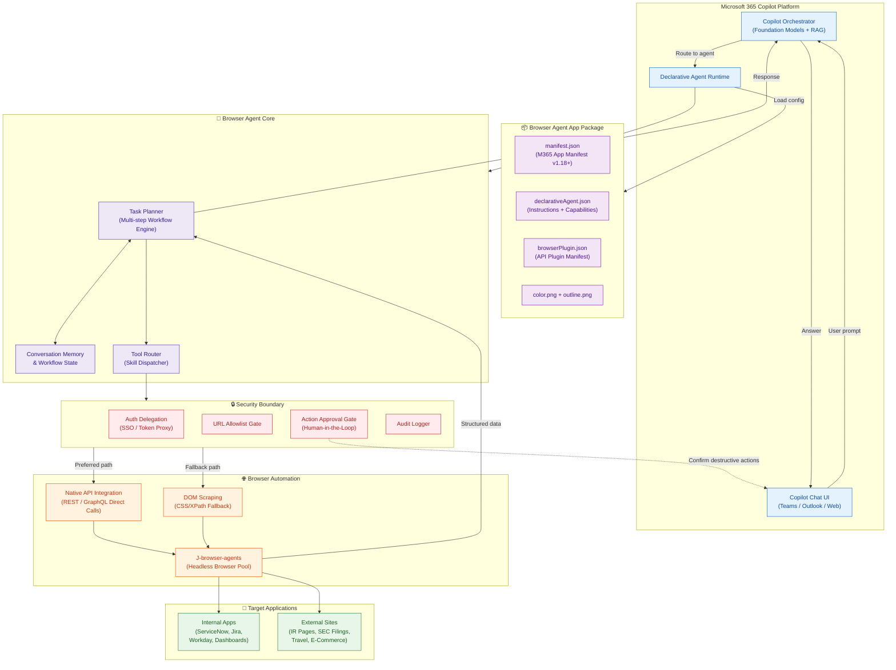
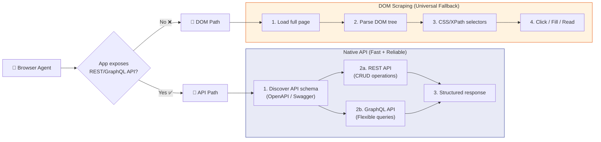
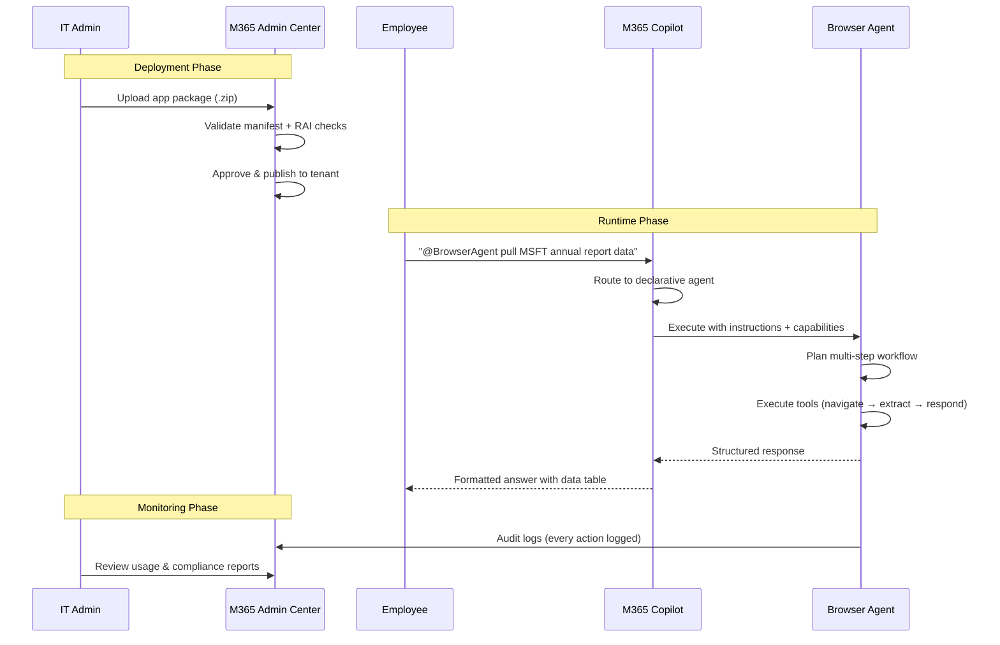

# Agents — Secure Enterprise Browser Agentic System

## Overview

This system is built as a **Microsoft 365 Copilot declarative agent** that combines the Copilot SDK orchestrator with browser automation (J-browser-agents) and **Native API Integration** (direct REST/GraphQL calls to target applications) to navigate, read, and act on internal and external web applications on behalf of enterprise users.

The agent is packaged and distributed through the Microsoft 365 app model, appearing contextually within Copilot Chat, Teams, Outlook, and other M365 surfaces.

---

## Agent Architecture



---

## Agent Types

### 1. Browser Navigation Agent (Primary)

The core agent that navigates web pages, extracts content, fills forms, and submits actions across enterprise applications.

| Property | Value |
|---|---|
| **Type** | Declarative Agent (M365 Copilot) |
| **Orchestrator** | Microsoft 365 Copilot Orchestrator |
| **Runtime** | Copilot SDK + J-browser-agents |
| **Protocol** | Native API (REST/GraphQL preferred) → DOM scraping (fallback) |
| **Auth** | Delegated SSO / Token Proxy |
| **Approval** | Human-in-the-loop for destructive actions |

### 2. Data Extraction Agent

A specialized sub-agent focused on reading and structuring data from web pages — financial tables, dashboards, reports.

| Property | Value |
|---|---|
| **Focus** | Read-only content extraction |
| **Output** | Structured tables, JSON, Markdown summaries |
| **Use Cases** | SEC filings, investor reports, analytics dashboards |
| **Security** | No write actions, no approval gates needed |

### 3. Workflow Automation Agent

Orchestrates multi-step, cross-application workflows spanning multiple web apps in a single session.

| Property | Value |
|---|---|
| **Focus** | Multi-step write workflows |
| **Pattern** | Navigate → Extract → Fill → Submit → Repeat |
| **Use Cases** | Incident resolution, onboarding, procurement |
| **Security** | Approval required for every write action |

---

## M365 App Package Structure

```
secure-browser-agent/
├── manifest.json                  # M365 App Manifest (v1.18+)
├── declarativeAgent.json          # Agent instructions & capabilities
├── browserPlugin.json             # API plugin (browser automation skills)
├── openapi/
│   ├── browser-tools.yml          # OpenAPI spec for browser tools
│   └── api-connectors.yml         # OpenAPI spec for native API connectors
├── color.png                      # 192x192 color icon
└── outline.png                    # 32x32 outline icon
```

### manifest.json (Simplified)

```json
{
  "$schema": "https://developer.microsoft.com/json-schemas/teams/v1.18/MicrosoftTeams.schema.json",
  "manifestVersion": "1.18",
  "version": "1.0.0",
  "id": "{{AGENT_APP_ID}}",
  "developer": {
    "name": "Enterprise Browser Agent",
    "websiteUrl": "https://github.com/example/secure-browser-agent",
    "privacyUrl": "https://example.com/privacy",
    "termsOfUseUrl": "https://example.com/terms"
  },
  "name": {
    "short": "Browser Agent",
    "full": "Secure Enterprise Browser Agent"
  },
  "description": {
    "short": "Navigate, read, and act on web apps securely",
    "full": "An AI agent that navigates internal and external web applications on behalf of the user — reading, summarizing, and taking actions — with enterprise security controls including auth delegation, URL allowlisting, and action approval gates."
  },
  "icons": {
    "color": "color.png",
    "outline": "outline.png"
  },
  "accentColor": "#1565C0",
  "copilotAgents": {
    "declarativeAgents": [
      {
        "id": "browser-agent",
        "file": "declarativeAgent.json"
      }
    ]
  }
}
```

### declarativeAgent.json

```json
{
  "$schema": "https://developer.microsoft.com/json-schemas/copilot/declarative-agent/v1.6/schema.json",
  "version": "v1.6",
  "name": "Secure Browser Agent",
  "description": "Navigates enterprise web apps, extracts data, fills forms, and submits actions with security controls.",
  "instructions": "You are a secure enterprise browser agent. You help users interact with internal web applications (ServiceNow, Jira, Workday, Grafana, etc.) and external sites (investor relations, SEC filings, travel portals). Always: (1) Check URL allowlist before navigating, (2) Use native REST/GraphQL APIs when available, fall back to DOM scraping, (3) Request user approval before any write/submit action, (4) Log all actions to audit trail. Never: navigate to URLs outside the allowlist, submit forms without explicit user approval, or expose auth tokens in responses.",
  "conversation_starters": [
    { "text": "Pull the SUMMARY RESULTS OF OPERATIONS from Microsoft's 2024 annual report" },
    { "text": "Close ServiceNow ticket INC0042 and link it to the Jira bug" },
    { "text": "Show me the error rate from the Grafana payments dashboard for the last hour" },
    { "text": "Book the cheapest direct flight from Seattle to New York on March 15" },
    { "text": "Start onboarding for new hire Jane Doe across Workday, Jira, and ServiceNow" }
  ],
  "capabilities": [
    { "name": "CodeInterpreter" }
  ],
  "actions": [
    {
      "id": "browser-tools",
      "file": "browserPlugin.json"
    }
  ]
}
```

---

## Native API Integration

The agent uses a **dual-path strategy** to interact with target web applications:



### Why Native API Integration + M365 Copilot?

| Aspect | Without Native APIs | With Native APIs |
|---|---|---|
| **Tool Discovery** | Agent must infer page structure from DOM | Agent discovers endpoints via OpenAPI/Swagger specs |
| **Reliability** | Brittle — breaks when UI changes | Stable — uses application's own API contract |
| **Speed** | Full page render + DOM parsing | Direct HTTP call with structured response |
| **Accuracy** | Risk of wrong element selection | Zero ambiguity — API defines exact operations |
| **Compatibility** | Depends on browser-specific protocols | Works with any HTTP client, any runtime |

### API Integration Points

1. **API Schema Discovery** — When the agent targets a new application, it probes for OpenAPI/Swagger specs (e.g., `/api/openapi.json`, `/swagger.json`, `/.well-known/api-spec`) to understand available endpoints
2. **REST API** — Standard CRUD operations (GET, POST, PUT, DELETE) for reading data, creating records, updating fields, and triggering actions
3. **GraphQL API** — Complex queries spanning multiple resources, flexible field selection, and batch operations
4. **Fallback** — If the application doesn't expose a usable API, the agent falls back to traditional DOM scraping via J-browser-agents

---

## Agent Lifecycle



---

## Related Files

- **[ARCHITECTURE.md](./ARCHITECTURE.md)** — Full system architecture diagram with all layers
- **[skills.md](./skills.md)** — Detailed skill definitions and tool specifications