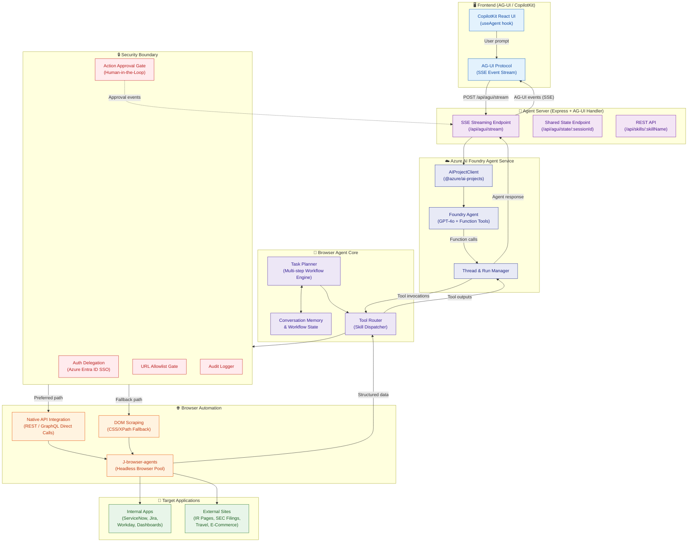
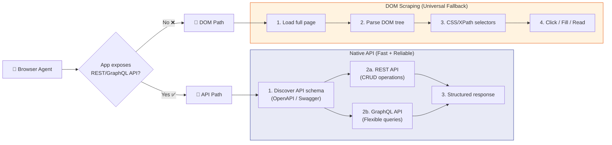
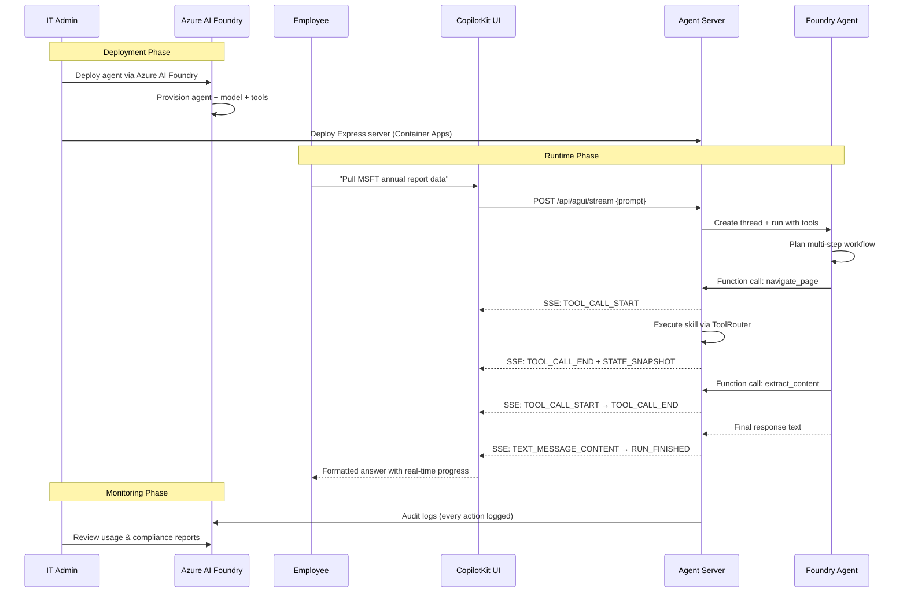
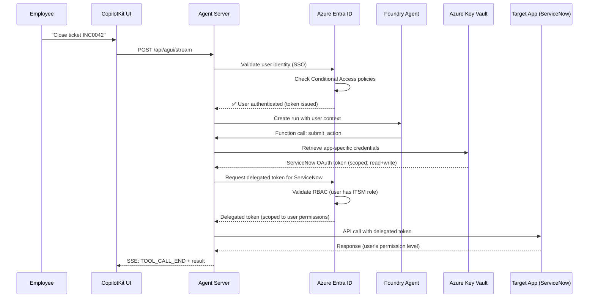
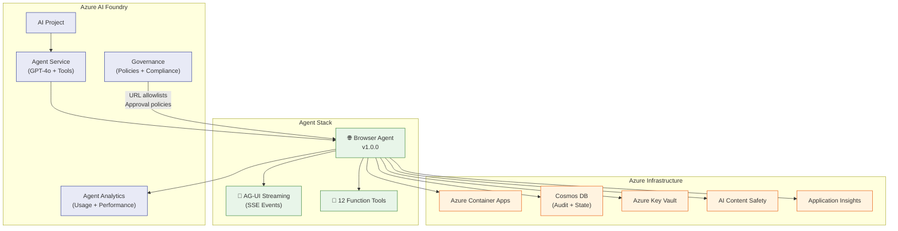

# Agents — Secure Enterprise Browser Agentic System

## Overview

This system is built as an **Azure AI Foundry Agent Service** (pro-code) application that combines the Microsoft Agent Framework with browser automation (J-browser-agents) and **Native API Integration** (direct REST/GraphQL calls to target applications) to navigate, read, and act on internal and external web applications on behalf of enterprise users.

The agent is powered by **Azure OpenAI Service (GPT-4o)** via the Azure AI Foundry Agent Service, authenticated through **Azure Entra ID**, protected by **Azure AI Content Safety**, and streamed to frontends via the **AG-UI protocol** (compatible with CopilotKit). It exposes Server-Sent Events (SSE) for real-time streaming updates, tool call progress, and shared state between agent and frontend.

---

## Agent Architecture



---

## AG-UI Protocol Integration

The agent server implements the **AG-UI (Agent-User Interaction) protocol** — an open, event-driven streaming standard for bidirectional communication between AI agents and frontends.

### AG-UI Event Types

| Category | Events | Purpose |
|---|---|---|
| **Lifecycle** | `RUN_STARTED`, `RUN_FINISHED`, `RUN_ERROR` | Track agent execution lifecycle |
| **Messages** | `TEXT_MESSAGE_START`, `TEXT_MESSAGE_CONTENT`, `TEXT_MESSAGE_END` | Stream LLM response tokens |
| **Tool Calls** | `TOOL_CALL_START`, `TOOL_CALL_ARGS`, `TOOL_CALL_END` | Show real-time skill execution |
| **State** | `STATE_SNAPSHOT`, `STATE_DELTA` | Sync shared state with frontend |

### Why AG-UI + CopilotKit?

| Aspect | Without AG-UI | With AG-UI |
|---|---|---|
| **Streaming** | Poll-based, delayed responses | Real-time SSE token streaming |
| **Tool Visibility** | Opaque — user waits blindly | Live tool call progress in UI |
| **Shared State** | Manual sync between agent and UI | Automatic state snapshots |
| **Frontend Flexibility** | Locked to one UI framework | Any AG-UI-compatible frontend |
| **Interoperability** | Custom protocol per agent | Open standard across all agents |

### CopilotKit Frontend Integration

```typescript
import { useAgent } from "@copilotkit/react-core";

function BrowserAgentUI() {
  const { messages, state, sendMessage, isLoading } = useAgent({
    endpoint: "https://your-server.com/api/agui/stream",
  });

  return (
    <div>
      {messages.map(msg => <ChatBubble key={msg.id} {...msg} />)}
      {state.lastSkill && <ToolProgress skill={state.lastSkill} />}
      <input onKeyPress={e =>
        e.key === 'Enter' ? sendMessage(e.target.value) : null
      } disabled={isLoading} />
    </div>
  );
}
```

---

## Agent Types

### 1. Browser Navigation Agent (Primary)

The core agent that navigates web pages, extracts content, fills forms, and submits actions across enterprise applications.

| Property | Value |
|---|---|
| **Type** | Azure AI Foundry Agent (pro-code) |
| **Orchestrator** | Azure AI Foundry Agent Service |
| **Runtime** | @azure/ai-projects + J-browser-agents |
| **Protocol** | AG-UI (SSE) for frontend, Native API (REST/GraphQL preferred) → DOM scraping (fallback) for targets |
| **Auth** | Azure Entra ID SSO / Token Proxy with Conditional Access |
| **Approval** | Human-in-the-loop for destructive actions |
| **AI Safety** | Azure AI Content Safety for input/output screening |

### 2. Data Extraction Agent

A specialized sub-agent focused on reading and structuring data from web pages — financial tables, dashboards, reports.

| Property | Value |
|---|---|
| **Focus** | Read-only content extraction |
| **Output** | Structured tables, JSON, Markdown summaries |
| **Use Cases** | SEC filings, investor reports, analytics dashboards |
| **Security** | No write actions, no approval gates needed |

### 3. Workflow Automation Agent

Orchestrates multi-step, cross-application workflows spanning multiple web apps in a single session.

| Property | Value |
|---|---|
| **Focus** | Multi-step write workflows |
| **Pattern** | Navigate → Extract → Fill → Submit → Repeat |
| **Use Cases** | Incident resolution, onboarding, procurement |
| **Security** | Approval required for every write action |

---

## Agent Package Structure

```
app-package/
├── manifest.json                  # Agent manifest (Azure AI Foundry)
├── declarativeAgent.json          # Agent config (model, instructions, streaming)
├── browserPlugin.json             # Function tool definitions
├── openapi/
│   ├── browser-tools.yml          # OpenAPI spec for browser tools
│   └── api-connectors.yml         # OpenAPI spec for native API connectors
├── color.png                      # 192x192 color icon
└── outline.png                    # 32x32 outline icon
```

---

## Native API Integration

The agent uses a **dual-path strategy** to interact with target web applications:



### Why Native API Integration + Azure AI Foundry?

| Aspect | Without Native APIs | With Native APIs |
|---|---|---|
| **Tool Discovery** | Agent must infer page structure from DOM | Agent discovers endpoints via OpenAPI/Swagger specs |
| **Reliability** | Brittle — breaks when UI changes | Stable — uses application's own API contract |
| **Speed** | Full page render + DOM parsing | Direct HTTP call with structured response |
| **Accuracy** | Risk of wrong element selection | Zero ambiguity — API defines exact operations |
| **Compatibility** | Depends on browser-specific protocols | Works with any HTTP client, any runtime |

### API Integration Points

1. **API Schema Discovery** — When the agent targets a new application, it probes for OpenAPI/Swagger specs (e.g., `/api/openapi.json`, `/swagger.json`, `/.well-known/api-spec`) to understand available endpoints
2. **REST API** — Standard CRUD operations (GET, POST, PUT, DELETE) for reading data, creating records, updating fields, and triggering actions
3. **GraphQL API** — Complex queries spanning multiple resources, flexible field selection, and batch operations
4. **Fallback** — If the application doesn't expose a usable API, the agent falls back to traditional DOM scraping via J-browser-agents

---

## Agent Lifecycle



---

## Related Files

- **[README.md](./README.md)** — Executive summary, Azure integration, ROI metrics, customer validation
- **[ARCHITECTURE.md](./ARCHITECTURE.md)** — Full system architecture diagram with all layers, Azure infrastructure, Responsible AI, observability
- **[skills.md](./skills.md)** — Detailed skill definitions, API plugin spec, Microsoft Graph skills, Azure AI Content Safety integration

---

## Azure Entra ID Authentication Flow

All agent-to-application authentication uses **Azure Entra ID** with delegated token proxy:



### Token Scoping by Skill

| Skill | Minimum Required Permission | Token Scope |
|---|---|---|
| `navigate_page` | Read | `Application.Read` |
| `extract_content` | Read | `Application.Read` |
| `fill_form` | Read + Write | `Application.ReadWrite` |
| `submit_action` | Read + Write + Execute | `Application.ReadWrite.All` |
| `discover_apis` | Read | `Application.Read` |
| Microsoft Graph skills | Varies | `Chat.ReadWrite`, `Mail.Send`, `Calendars.ReadWrite` |

---

## Azure AI Foundry Integration

The browser agent is deployed and managed via **Azure AI Foundry** for enterprise-scale agent management:



### Cross-Agent Handoff Scenarios

| Scenario | Browser Agent Does | Hands Off To |
|---|---|---|
| Financial report + analysis | Extracts data from IR pages | **Fabric Data Agent** for statistical analysis |
| Incident + stakeholder notification | Reads incident details | **Outlook Agent** to email stakeholders |
| Onboarding + calendar setup | Creates accounts across apps | **Calendar Agent** to schedule orientation meetings |
| Compliance audit + reporting | Scrapes regulatory filings | **Fabric Data Agent** for compliance dashboard |

---

## Microsoft Fabric Analytics

Agent activity data streams into **Microsoft Fabric** via Cosmos DB change feed:

- **Usage Dashboards** — Skill invocation patterns, most-accessed apps, peak hours, user adoption curves
- **Workflow Intelligence** — ML models identify bottleneck steps and recommend faster paths (e.g., "ServiceNow API is 3x faster than DOM for ticket updates")
- **Cost Optimization** — Track Azure OpenAI token consumption, Container Apps compute costs, and per-workflow ROI
- **Compliance Reporting** — Auto-generated audit reports with tamper-proof provenance from Cosmos DB