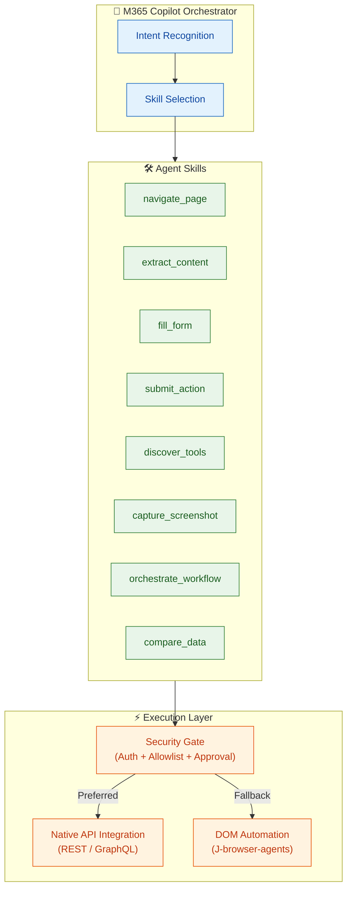
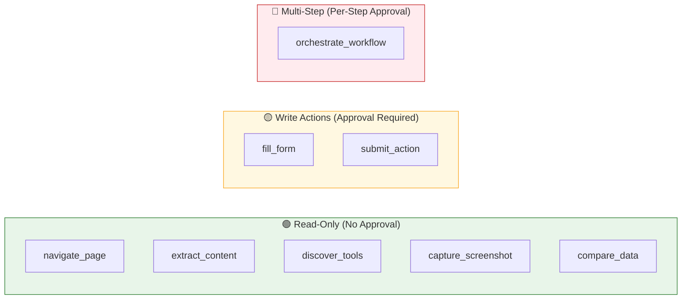

# Skills — Secure Enterprise Browser Agentic System

## Overview

Skills are the capabilities that the Browser Agent exposes to the Microsoft 365 Copilot orchestrator. Each skill maps to a **tool** that the agent can invoke during multi-step workflows. Skills are defined as API plugin actions in the agent's app package and are executed through the browser automation layer (J-browser-agents) with optional native API acceleration when target applications expose REST/GraphQL endpoints.

---

## Skill Architecture



---

## Core Skills

### 1. `navigate_page`

Navigate the browser to a specified URL, with optional click/scroll actions to reach a target element.

| Property | Detail |
|---|---|
| **Type** | Browser Navigation |
| **Security** | URL allowlist check required |
| **API Path** | Uses REST API for direct navigation/resource access when available |
| **Fallback** | Direct URL load + DOM click via CSS/XPath selectors |

**Parameters:**

```yaml
navigate_page:
  url: string              # Target URL (validated against allowlist)
  click_target?: string    # Optional CSS selector or text to click after page load
  scroll_to?: string       # Optional element to scroll into view
  wait_for?: string        # Optional selector to wait for before returning
  timeout?: number         # Max wait time in ms (default: 30000)
```

**Example Invocations:**

```
navigate_page(url: "https://servicenow.corp/incident/INC0042")
navigate_page(url: "https://microsoft.com/investor", click_target: "a:contains('2024 Annual Report')")
navigate_page(url: "https://jira.corp/browse/BUG-7891", wait_for: "#issue-detail")
```

---

### 2. `extract_content`

Read and structure content from the current page — tables, text blocks, lists, form values, or specific DOM elements.

| Property | Detail |
|---|---|
| **Type** | Content Extraction (Read-only) |
| **Security** | No write action — no approval gate needed |
| **API Path** | Uses REST/GraphQL endpoints to call application read methods directly |
| **Fallback** | DOM parsing with CSS/XPath, table extraction, text summarization |

**Parameters:**

```yaml
extract_content:
  target: string            # What to extract: "table", "text", "form_values", "links", "all"
  selector?: string         # Optional CSS selector to scope extraction
  label?: string            # Optional text label to find (e.g., "SUMMARY RESULTS OF OPERATIONS")
  format?: string           # Output format: "markdown" (default), "json", "csv"
  summarize?: boolean       # If true, summarize long text content (default: false)
```

**Example Invocations:**

```
extract_content(target: "table", label: "SUMMARY RESULTS OF OPERATIONS", format: "markdown")
extract_content(target: "text", selector: "#incident-description", summarize: true)
extract_content(target: "all", format: "json")
```

**Example Output (Microsoft IR Annual Report):**

```markdown
| (In millions, except per share) | FY 2024   | FY 2023   | % Change |
|---------------------------------|-----------|-----------|----------|
| Revenue                         | $245,122  | $211,915  | 16%      |
| Gross margin                    | $171,008  | $146,052  | 17%      |
| Operating income                | $109,433  | $88,523   | 24%      |
| Net income                      | $88,136   | $72,361   | 22%      |
| Diluted EPS                     | $11.80    | $9.68     | 22%      |
```

---

### 3. `fill_form`

Populate form fields on the current page with provided values.

| Property | Detail |
|---|---|
| **Type** | Form Input (Write action) |
| **Security** | ⚠️ Approval gate required (PII-sensitive or state-changing) |
| **API Path** | Uses REST API to populate fields via PUT/PATCH requests directly |
| **Fallback** | DOM selector-based input simulation |

**Parameters:**

```yaml
fill_form:
  fields:                     # Key-value map of form fields to populate
    - selector: string        # CSS selector or field name/label
      value: string           # Value to enter
      type?: string           # "text" (default), "select", "checkbox", "radio", "date"
  submit?: boolean            # Auto-submit after filling (default: false)
```

**Example Invocations:**

```
fill_form(fields: [
  { selector: "#employee-name", value: "Jane Doe" },
  { selector: "#department", value: "Engineering", type: "select" },
  { selector: "#start-date", value: "2026-03-02", type: "date" }
])
```

---

### 4. `submit_action`

Trigger a button click, form submission, or state-changing action on the current page.

| Property | Detail |
|---|---|
| **Type** | Action Execution (Write action) |
| **Security** | ⚠️ Human-in-the-loop approval required for all destructive actions |
| **API Path** | Uses REST API for form submit (POST), GraphQL mutations for complex transitions |
| **Fallback** | DOM click on button/link elements |

**Parameters:**

```yaml
submit_action:
  action: string             # Action description (e.g., "close_ticket", "approve", "submit")
  selector?: string          # CSS selector of the button/element to click
  confirm_message?: string   # Message shown to user for approval
  data?: object              # Optional payload data for the action
```

**Example Invocations:**

```
submit_action(action: "close_ticket", selector: "#close-btn", confirm_message: "Close ticket INC0042?")
submit_action(action: "submit_booking", data: { flight: "AS204", class: "economy" })
```

---

## API-Enhanced Skills

### 5. `discover_apis`

Query a target application for its available API endpoints. Probes for OpenAPI/Swagger specifications, well-known API paths, and API documentation pages. Returns the list of structured endpoints the application supports, enabling the agent to skip DOM guessing entirely.

| Property | Detail |
|---|---|
| **Type** | Discovery (Read-only) |
| **Protocol** | OpenAPI / Swagger / Well-Known API Detection |
| **When** | Automatically invoked on first navigation to any new domain |

**Parameters:**

```yaml
discover_apis:
  url: string               # Domain or base URL to probe for API specifications
```

**Example Output:**

```json
{
  "site": "travel.corp",
  "api_version": "v2",
  "spec_url": "https://travel.corp/api/openapi.json",
  "endpoints": [
    {
      "name": "search_flights",
      "method": "GET",
      "path": "/api/flights/search",
      "description": "Search for flights by origin, destination, and date",
      "parameters": {
        "from": "IATA code",
        "to": "IATA code",
        "date": "ISO 8601 date",
        "direct": "boolean"
      }
    },
    {
      "name": "get_flight",
      "method": "GET",
      "path": "/api/flights/{id}",
      "description": "Get details of a specific flight",
      "parameters": {
        "id": "string"
      }
    },
    {
      "name": "submit_booking",
      "method": "POST",
      "path": "/api/bookings",
      "description": "Submit a flight booking",
      "parameters": {
        "flight_id": "string",
        "passenger": "object",
        "approval_type": "self | manager"
      }
    }
  ]
}
```

---

### 6. `capture_screenshot`

Take a screenshot of the current page or a specific element for visual context or debugging.

| Property | Detail |
|---|---|
| **Type** | Visual Capture (Read-only) |
| **Security** | No approval needed; PII redaction applied automatically |
| **Use Case** | Debugging, visual confirmation, accessibility fallback |

**Parameters:**

```yaml
capture_screenshot:
  selector?: string          # Optional: capture only a specific element
  full_page?: boolean        # Capture full scrollable page (default: false)
  redact_pii?: boolean       # Auto-redact detected PII (default: true)
```

---

## Compound Skills

### 7. `orchestrate_workflow`

Execute a multi-step workflow across multiple web applications in a single agent turn.

| Property | Detail |
|---|---|
| **Type** | Multi-step Orchestration |
| **Security** | Each write step requires individual approval |
| **Pattern** | Chain of: navigate → extract → fill → submit → navigate → ... |

**Parameters:**

```yaml
orchestrate_workflow:
  name: string               # Workflow template name
  steps:                     # Ordered list of skill invocations
    - skill: string          # Skill name (navigate_page, extract_content, etc.)
      params: object         # Skill parameters
      approval_required?: boolean
```

**Example — Incident Resolution Workflow:**

```yaml
orchestrate_workflow:
  name: "incident_resolution"
  steps:
    - skill: navigate_page
      params: { url: "https://servicenow.corp/INC0042" }

    - skill: extract_content
      params: { target: "text", selector: "#description" }

    - skill: navigate_page
      params: { url: "https://jira.corp/search?q=payment-timeout" }

    - skill: extract_content
      params: { target: "links", selector: ".issue-list" }

    - skill: navigate_page
      params: { url: "https://grafana.corp/d/payments?last=1h" }

    - skill: extract_content
      params: { target: "text", selector: ".panel-content" }

    - skill: navigate_page
      params: { url: "https://servicenow.corp/INC0042/notes" }

    - skill: fill_form
      params:
        fields:
          - selector: "#work-notes"
            value: "{{compiled_findings}}"
      approval_required: true

    - skill: submit_action
      params: { action: "update_notes", selector: "#save-btn" }
      approval_required: true
```

---

### 8. `compare_data`

Extract comparable data from multiple sources and produce a structured comparison table.

| Property | Detail |
|---|---|
| **Type** | Multi-source Extraction + Analysis |
| **Security** | Read-only — no approval gates |
| **Use Case** | Competitive analysis, vendor comparison, compliance audit |

**Parameters:**

```yaml
compare_data:
  sources:
    - url: string            # Target URL
      extract: object        # extract_content parameters
      label: string          # Column label in output
  output_format: string      # "markdown" | "json" | "csv"
```

**Example — Annual Report Comparison:**

```yaml
compare_data:
  sources:
    - url: "https://microsoft.com/investor/reports/ar24/"
      extract: { target: "table", label: "SUMMARY RESULTS OF OPERATIONS" }
      label: "MSFT"
    - url: "https://abc.xyz/investor/"
      extract: { target: "table", label: "Consolidated Statements of Income" }
      label: "GOOGL"
    - url: "https://ir.aboutamazon.com/annual-reports/"
      extract: { target: "table", label: "Consolidated Statements of Operations" }
      label: "AMZN"
  output_format: "markdown"
```

---

## Skill ↔ API Integration Mapping

This table shows how each skill leverages native APIs when available:

| Skill | REST API | GraphQL API | DOM Fallback |
|---|---|---|---|
| `navigate_page` | ✅ Direct resource access | — | ✅ URL load + click |
| `extract_content` | ✅ GET endpoints | ✅ Flexible queries | ✅ DOM parse |
| `fill_form` | ✅ PUT/PATCH fields | ✅ Mutations | ✅ Input simulation |
| `submit_action` | ✅ POST / DELETE | ✅ Mutations | ✅ Button click |
| `discover_apis` | N/A (discovery is the mechanism itself) | N/A | N/A |
| `capture_screenshot` | — | — | ✅ Browser API |
| `orchestrate_workflow` | ✅ Per-step | ✅ Per-step | ✅ Per-step |
| `compare_data` | ✅ GET endpoints | ✅ Flexible queries | ✅ DOM parse |

---

## Security Classification

Every skill is classified by its security impact:



---

## API Plugin Specification

Skills are exposed to the M365 Copilot orchestrator as an API plugin. The OpenAPI specification defines the REST endpoints that the Copilot SDK calls when invoking each skill.

### browserPlugin.json (Simplified)

```json
{
  "$schema": "https://developer.microsoft.com/json-schemas/copilot/plugin/v2.2/schema.json",
  "schema_version": "v2.2",
  "name_for_human": "Browser Automation Tools",
  "description_for_human": "Navigate, read, and act on web applications securely.",
  "description_for_model": "Use these tools to navigate web pages, extract structured content like tables and text, fill forms, submit actions, and orchestrate multi-step workflows across enterprise web applications. Always check URL allowlist and request user approval for write actions.",
  "functions": [
    {
      "name": "navigate_page",
      "description": "Navigate to a URL and optionally click or scroll to a target element",
      "parameters": {
        "type": "object",
        "required": ["url"],
        "properties": {
          "url": { "type": "string", "description": "Target URL" },
          "click_target": { "type": "string", "description": "CSS selector or text to click" },
          "wait_for": { "type": "string", "description": "Selector to wait for" }
        }
      }
    },
    {
      "name": "extract_content",
      "description": "Extract structured content from the current page — tables, text, links, or form values",
      "parameters": {
        "type": "object",
        "required": ["target"],
        "properties": {
          "target": { "type": "string", "enum": ["table", "text", "links", "form_values", "all"] },
          "selector": { "type": "string" },
          "label": { "type": "string", "description": "Text label to find on page" },
          "format": { "type": "string", "enum": ["markdown", "json", "csv"], "default": "markdown" }
        }
      }
    },
    {
      "name": "fill_form",
      "description": "Fill form fields on the current page. Requires user approval.",
      "parameters": {
        "type": "object",
        "required": ["fields"],
        "properties": {
          "fields": {
            "type": "array",
            "items": {
              "type": "object",
              "properties": {
                "selector": { "type": "string" },
                "value": { "type": "string" },
                "type": { "type": "string", "enum": ["text", "select", "checkbox", "radio", "date"] }
              }
            }
          }
        }
      }
    },
    {
      "name": "submit_action",
      "description": "Execute a button click or form submission. Requires user approval for destructive actions.",
      "parameters": {
        "type": "object",
        "required": ["action"],
        "properties": {
          "action": { "type": "string" },
          "selector": { "type": "string" },
          "confirm_message": { "type": "string" }
        }
      }
    },
    {
      "name": "discover_apis",
      "description": "Probe a target application for available REST/GraphQL API endpoints via OpenAPI/Swagger specs",
      "parameters": {
        "type": "object",
        "required": ["url"],
        "properties": {
          "url": { "type": "string" }
        }
      }
    },
    {
      "name": "compare_data",
      "description": "Extract and compare data from multiple web sources into a unified table",
      "parameters": {
        "type": "object",
        "required": ["sources"],
        "properties": {
          "sources": {
            "type": "array",
            "items": {
              "type": "object",
              "properties": {
                "url": { "type": "string" },
                "extract": { "type": "object" },
                "label": { "type": "string" }
              }
            }
          },
          "output_format": { "type": "string", "enum": ["markdown", "json", "csv"] }
        }
      }
    }
  ]
}
```

---

## Related Files

- **[ARCHITECTURE.md](./ARCHITECTURE.md)** — Full system architecture diagram with all layers and examples
- **[agents.md](./agents.md)** — Agent types, M365 app packaging, and API integration strategy
